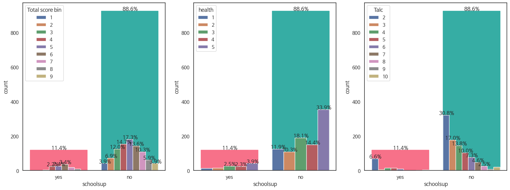

# 황교수님’s 도비들

* 데이터셋: 학생 음주 데이터셋
* 분석 목표: 학생의 지덕체를 수양하기 이로운 환경 분석
* 비고: 쭉 가
* 제출 자료(GIt): https://github.com/komingsu/AIFFEL_ON3_EDA
* 제출 자료(notion): https://www.notion.so/s-ff419b624ffc4df59581b5d33df98ec3
* 팀 번호: 2 팀
* 팀원: 장서현, 강가원
* 팀장: 고민수

# 지🧠, 덕🫂, 체🦿를 모두 가진 학생들의 환경 분석🔎

## **회고**

- **강가원**
  - 한 일
    - health 데이터에 대한 EDA 및 관련 변수 클러스터링을 진행했다.
  - 잘한 일
    - health 데이터와 다른 변수들간 상관관계 분석과 해석을 수행하면서 기존에 학습한 EDA 기법들을 정리하고 응용해보는 시간을 가졌다.
    - 변수 중요도 도출 결과에 따라 변수간의 상관관계를 효과적으로 나타내기 위해 최적의 시각화 방법을 고민해보면서 데이터에 대한 인사이트를 얻을 수 있었다.
  - 못한 일
    - lightgbm 모델을 대상으로 shap기반 모델 해석을 진행했는데 충분한 모델 학습을 진행하지 못해 모델 성능이 낮게 도출되었고 모델 해석 결과에 영향이 있을 것 같다.
      - 개선 방향: 하이퍼 파라미터 튜닝 등의 추가 모델 개선 방안을 추가 진행하고 XAI 해석을 하자.
    - 시각화 툴을 좀 더 자유자재로 응용하고 숙달할 수 있도록 노력해야겠다.
- **고민수👽**
  - 머릿속에서 그려지는 상관관계를 시각적으로 보고자 하는 마음이 얼마나 코스트가 큰지 깨달았습니다. 그래도 이 기회를 통해서 다른 상황에도 적용할 수 있는 함수를 만들어 둘 수 있었고, 상황에 어울리는 그래프를 연결할 수 있는 능력이 생겼습니다. 다만 조금 아쉬운 점은 대부분의 시각화를 matplotlib.pyplot 과 seaborn 을 통해 진행했는데, plotly와 같은 좀 더 유연하고 좋은 라이브러리를 사용했다면 하는 아쉬움이 있습니다.
- **장서현**
  - 노드를 보며 이미 작성되어있는 흐름대로 따라가기만 하다가 내가 원하는 흐름을 만들어서 가시화 자료를 구현하고 유의미한 데이터를 얻는게 참 힘들고 시간이 많이 소요되는 작업이구나 라는것을 느낄 수 있던 시간이었습니다. 진행을 하면서 함수작성할때, 가시화 코드 작성할때, 다른 사람 코드 해석할 때 등등 뇌정지온 순간이 굉장히 길고 많았는데, 다른 팀원분들께서 하시는 것 보면서 힌트도 얻고 전처리로 어디까지 확인할 수 있는지 등등 도움을 많이 받았습니다.
  - 앞으로의 다짐
    - 함수를 잘 활용하자
    - 학습 모델을 사용하고자 한다면 학습 메커니즘과 도출 근거를 잘 알고 사용하자 (수월한 데이터 해석과 개선 점 파악을 위해)

## 1. 개요

### **1.1 프로젝트 주제**

- “**학생 음주 데이터을 활용한 데이터분석”** 이라는 주제로 **지**, **덕**, **체**를 고루 갖춘 학생들은 어떤 환경적 요인을 가지는지 분석하고 시각화 하고자합니다.
- [Student Alcohol Consumption | Kaggle](https://www.kaggle.com/datasets/uciml/student-alcohol-consumption)

### **1.2 프로젝트 목적**

학생이라면 모름지기 성실하게 공부하여 높은 성적을 이루고, 나쁜 것을 피하고, 심신이 건강해야 함이 본분일 것입니다. 이에 저희 조는 그런 학생이 되는 최적의 조건은 무엇인가 낱낯낫낟이 파헤쳐 보고자 합니다.

저의가 정의한 **지, 덕, 체**는 다음과 같습니다

- **지**🧠 : 높은 성적을 가지는 학생들의 환경적 요인 분석
- **덕**🫂 : 음주를 많이 하는 학생들의 환경적 요인 분석
- **체**🦿 : 건강한 학생들의 환경적 요인 분석

### **1.3 프로젝트 진행 순서**

- 데이터 전처리를 수행합니다.
- 전체적인 data skimming과 거주🏠, 부모👫, 학업✏️, 생활습관 🍺 등으로 세분화하여 데이터 시각화를 진행하고, 각 요인분석에서 중요한 특성을 분석합니다.
- 또한 “**지덕체”** 뿐만 아니라 환경적 요인끼리 나타나는 특징도 시각화📈 하였습니다.
- 결론을 도출합니다.
- 감사합니다.

### **1.4 데이터 소개**

- **Target features**
  Dalc - 평일에 술마시는 정도 [1(없음) / 2 / 3/ 4/ 5(아주많음) ]
  Walc - 주말에 술마시는 정도 [1(없음) / 2 / 3/ 4/ 5(아주많음) ]
  health - 건강 정도 [1(아주나쁨) / 2 / 3/ 4/ 5(아주좋음) ]
  G1 - first period grade [ 0 ~ 20 ]
  G2 - second period grade [ 0 ~ 20 ]
  G3 - final grade [ 0 ~ 20 ] - target
  ***
  생성한 Target features
  GT - 총점 [G1 + G2 + G3 의 값]
  GT_scale - 총점 standard scale [0을 기준으로 정규화한 총점]
  GT_scale_rank - GT_scale을 기준으로 매긴 등수
  GT_scale_rank_bin - GT_scale_rank를 기준으로 한국식 등급표 적용
  Talc - 술을 마시는 정도 (Dalc + Walc) [2(없음) ~ 10(아주많음)]
- **Binary features**
  - **Code**
    ```python
    bin_feature = ['schoolsup', 'famsup', 'paid', 'activities', 'nursery', 'higher',
                   'internet', 'romantic', 'school', 'sex', 'address', 'famsize', 'Pstatus']

    for idx, feature in enumerate(bin_feature):
        plt.figure(figsize=(20,7))
        ax = plt.subplot(1,3,1)
        sns.countplot(x=feature,
                     data=both,
                     ax=ax)
        for idx in range(len(ax.patches)):
            ax.patches[idx].set_color(sns.husl_palette(len(ax.patches))[idx])
        sns.countplot(x=feature,
                     data=both,
                      hue="GT_scale_rank_bin",
                     ax=ax)
        write_percent(ax, len(both))
        plt.legend(title="Total score bin")

        ax = plt.subplot(1,3,2)
        sns.countplot(x=feature,
                     data=both,
                     ax=ax)
        for idx in range(len(ax.patches)):
            ax.patches[idx].set_color(sns.husl_palette(len(ax.patches))[idx])
        sns.countplot(x=feature,
                     data=both,
                      hue="health",
                     ax=ax)
        write_percent(ax, len(both))

        ax = plt.subplot(1,3,3)
        sns.countplot(x=feature,
                     data=both,
                     ax=ax)
        for idx in range(len(ax.patches)):
            ax.patches[idx].set_color(sns.husl_palette(len(ax.patches))[idx])
        sns.countplot(x=feature,
                     data=both,
                      hue="Talc",
                     ax=ax)
        write_percent(ax, len(both))
        plt.show()
    ```
  schoolsup - 학교의 지원 [유/무]
  
  famsup - 부모의 지원 [유/무]
  
  paid - 사교육 [유/무]
  
  activities - 교외 활동 [유/무]
  
  nursery - 유치원 출신 [유/무]
  
  higher - 목표의식 [유/무]
  
  Pstatus - 부모님과 동거 [유/무]
  
  internet - 인터넷 [유/무]
  
  romantic - 연애 [유/무]
  
  school - 학교의 종류 [GP/MS]
  
  sex - 성별 [남/여]
  
  address -거주 [도시/시골]
  
  famsize - 가족구성의 크기 [3명이하/3명초과]
  
- **Nominal features**
  - **Code**
    ```python
    nom_feature = ["Mjob","Fjob","reason","guardian"]

    # 교차분석표
    def get_crosstab_mean(df, feature, target="target"):
        crosstab = pd.crosstab(df[feature], df[target])
        crosstab["count"] = crosstab.sum(axis=1)
        for i in crosstab.columns[:-1]:
            crosstab[i] = crosstab[i]*i
        crosstab["sum"] = crosstab.sum(axis=1)
        crosstab["mean"] = crosstab["sum"] / crosstab["count"]
        crosstab = crosstab.reset_index()
        return crosstab

    ## 새로운 x축에 그래프 그리기
    def plot_pointplot(ax, feature, crosstab, target):
        ax2= ax.twinx() # x 축은 공유하고 y 축은 공유하지 않는 새로운 축
        ax2= sns.pointplot(x=feature,y="mean", data=crosstab,
                          order=crosstab[feature].values, # 포인트 플롯의 순서
                          color="black") # 범례표시 x
        ax2.set_ylim(crosstab["mean"].min()*0.95, crosstab["mean"].max()*1.05)
        ax2.set_ylabel(f"{target} mean")

    for idx, feature in enumerate(nom_feature):
        ###
        plt.figure(figsize=(20,7))
        ax = plt.subplot(1,3,1)
        crosstab = get_crosstab_mean(both, feature, target="GT_scale_rank_bin") # 교차 분석표 작성
        # ax축에 그래프 그리기
        sns.countplot(x=feature, data=both,
                     order=crosstab[feature].values,
                     ax=ax)
        # 축에 색 넣기
        for idx in range(len(ax.patches)):
            ax.patches[idx].set_color(sns.husl_palette(len(ax.patches))[idx])
        # 비율 표시
        write_percent(ax, len(both))
        # ax2축에 포인트 플랏그리기
        plot_pointplot(ax, feature, crosstab,target="GT_scale_rank_bin")
        ax.set_title(f"{feature} Distribution") # 타이틀 설정

        ###
        ax = plt.subplot(1,3,2)
        crosstab = get_crosstab_mean(both, feature, target="health") # 교차 분석표 작성
        # ax축에 그래프 그리기
        sns.countplot(x=feature, data=both,
                     order=crosstab[feature].values,
                     ax=ax)
        # 축에 색 넣기
        for idx in range(len(ax.patches)):
            ax.patches[idx].set_color(sns.husl_palette(len(ax.patches))[idx])
        # 비율 표시
        write_percent(ax, len(both))
        # ax2축에 포인트 플랏그리기
        plot_pointplot(ax, feature, crosstab,target="health")
        ax.set_title(f"{feature} Distribution") # 타이틀 설정

        ###
        ax = plt.subplot(1,3,3)
        crosstab = get_crosstab_mean(both, feature, target="Talc") # 교차 분석표 작성
        # ax축에 그래프 그리기
        sns.countplot(x=feature, data=both,
                     order=crosstab[feature].values,
                     ax=ax)
        # 축에 색 넣기
        for idx in range(len(ax.patches)):
            ax.patches[idx].set_color(sns.husl_palette(len(ax.patches))[idx])
        # 비율 표시
        write_percent(ax, len(both))
        # ax2축에 포인트 플랏그리기
        plot_pointplot(ax, feature, crosstab,target="Talc")
        ax.set_title(f"{feature} Distribution") # 타이틀 설정
        plt.tight_layout()
        plt.show()
    ```
  Mjob - 어머니의 직업 - [선생님/의료/서비스/주부/기타]
  
  Fjob - 아버지의 직업 - [선생님/의료/서비스/주부/기타]
  
  reason - 학교를 다니는 이유 - [집과의거리/평판/교과과정/기타]
  
  guardian - 보호자 - [어머니/아버지/기타]
  
- **Order features**
  - **Code**
    ```python
    from pandas.api.types import CategoricalDtype
    ## ord feature
    ord_feature = ['Medu', 'Fedu', 'traveltime', 'studytime', 'failures', 'famrel', 'freetime', 'goout']
    ## ord dict
    ord_Medu_dict = {0:"None",1:"4학년",2:"5~9학년",3:"고등학교",4:"대학이상"}
    ord_Fedu_dict = {0:"None",1:"4학년",2:"5~9학년",3:"고등학교",4:"대학이상"}
    ord_traveltime_dict = {1:"<15분",2:"15~30분",3:"30~60분",4:"60분 이상"}
    ord_studytime_dict = {1:"2시간 이하",2:"2~5시간",3:"5~10시간",4:"10시간 이상"}
    ord_failures_dict = {0:"없음",1:"1회", 2:"2회",3:"3회",4:"4회 이상"}
    ord_famrel_dict = {1:"아주 나쁨",2:"나쁨",3:"평균",4:"좋음",5:"아주좋음"}
    ord_freetime_dict = {1:"없음",2:"조금 없음",3:"평균",4:"조금 많음",5:"많음"}
    ord_goout_dict = {1:"없음",2:"조금 없음",3:"평균",4:"조금 많음",5:"많음"}

    # 값 변환
    both_ord = both.copy()
    both_ord["Medu"] = both_ord["Medu"].apply(lambda x:ord_Medu_dict[x])
    both_ord["Fedu"] = both_ord["Fedu"].apply(lambda x:ord_Fedu_dict[x])
    both_ord["traveltime"] = both_ord["traveltime"].apply(lambda x:ord_traveltime_dict[x])
    both_ord["studytime"] = both_ord["studytime"].apply(lambda x:ord_studytime_dict[x])
    both_ord["failures"] = both_ord["failures"].apply(lambda x:ord_failures_dict[x])
    both_ord["famrel"] = both_ord["famrel"].apply(lambda x:ord_famrel_dict[x])
    both_ord["freetime"] = both_ord["freetime"].apply(lambda x:ord_freetime_dict[x])
    both_ord["goout"] = both_ord["goout"].apply(lambda x:ord_goout_dict[x])

    # type 변경
    ord_Medu = CategoricalDtype(categories=list(ord_Medu_dict.values()), ordered=True)
    ord_Fedu = CategoricalDtype(categories=list(ord_Fedu_dict.values()), ordered=True)
    ord_traveltime = CategoricalDtype(categories=list(ord_traveltime_dict.values()), ordered=True)
    ord_studytime = CategoricalDtype(categories=list(ord_studytime_dict.values()), ordered=True)
    ord_failures = CategoricalDtype(categories=list(ord_failures_dict.values()), ordered=True)
    ord_famrel = CategoricalDtype(categories=list(ord_famrel_dict.values()), ordered=True)
    ord_freetime = CategoricalDtype(categories=list(ord_freetime_dict.values()), ordered=True)
    ord_goout = CategoricalDtype(categories=list(ord_goout_dict.values()), ordered=True)
    both_ord["Medu"] =both_ord["Medu"].astype(ord_Medu)
    both_ord["Fedu"] =both_ord["Fedu"].astype(ord_Fedu)
    both_ord["traveltime"] =both_ord["traveltime"].astype(ord_traveltime)
    both_ord["studytime"] =both_ord["studytime"].astype(ord_studytime)
    both_ord["failures"] =both_ord["failures"].astype(ord_failures)
    both_ord["famrel"] =both_ord["famrel"].astype(ord_famrel)
    both_ord["freetime"] =both_ord["freetime"].astype(ord_freetime)
    both_ord["goout"] =both_ord["goout"].astype(ord_goout)

    ## 그래프 그리기
    for idx, feature in enumerate(ord_feature):
        ###
        plt.figure(figsize=(20,7))
        ax = plt.subplot(1,3,1)
        crosstab = get_crosstab_mean(both_ord, feature, target="GT_scale_rank_bin") # 교차 분석표 작성
        # ax축에 그래프 그리기
        sns.countplot(x=feature, data=both_ord,
                     order=crosstab[feature].values,
                     ax=ax)
        # 축에 색 넣기
        for idx in range(len(ax.patches)):
            ax.patches[idx].set_color(sns.husl_palette(len(ax.patches))[idx])
        # 비율 표시
        write_percent(ax, len(both_ord))
        # ax2축에 포인트 플랏그리기
        plot_pointplot(ax, feature, crosstab,target="GT_scale_rank_bin")
        ax.set_title(f"{feature} Distribution") # 타이틀 설정

        ###
        ax = plt.subplot(1,3,2)
        crosstab = get_crosstab_mean(both_ord, feature, target="health") # 교차 분석표 작성
        # ax축에 그래프 그리기
        sns.countplot(x=feature, data=both_ord,
                     order=crosstab[feature].values,
                     ax=ax)
        # 축에 색 넣기
        for idx in range(len(ax.patches)):
            ax.patches[idx].set_color(sns.husl_palette(len(ax.patches))[idx])
        # 비율 표시
        write_percent(ax, len(both_ord))
        # ax2축에 포인트 플랏그리기
        plot_pointplot(ax, feature, crosstab,target="health")
        ax.set_title(f"{feature} Distribution") # 타이틀 설정

        ###
        ax = plt.subplot(1,3,3)
        crosstab = get_crosstab_mean(both_ord, feature, target="Talc") # 교차 분석표 작성
        # ax축에 그래프 그리기
        sns.countplot(x=feature, data=both_ord,
                     order=crosstab[feature].values,
                     ax=ax)
        # 축에 색 넣기
        for idx in range(len(ax.patches)):
            ax.patches[idx].set_color(sns.husl_palette(len(ax.patches))[idx])
        # 비율 표시
        write_percent(ax, len(both_ord))
        # ax2축에 포인트 플랏그리기
        plot_pointplot(ax, feature, crosstab,target="Talc")
        ax.set_title(f"{feature} Distribution") # 타이틀 설정
        plt.tight_layout()
        plt.show()
    ```
  Medu - 어머니의 최종학력 [ None / 4학년 / 9학년 / 고등학교 / 대학교 이상 ]
  
  Fedu - 아버지의 최종학력 [ None / 4학년 / 9학년 / 고등학교 / 대학교 이상 ]
  
  traveltime - 통학시간 [ 1 ( <15 min) / 2 (15 to 30 min) / 3 (30 min. to 1 hour) / 4 ( >1 hour) ]
  
  studytime - 주당 공부시간 [ 1 (<2 hours) / 2 (2 to 5 hours) / 3 (5 to 10 hours) / 4 ( >10 hours) ]
  
  failures - 낙제 횟수 [ 0 / 1 / 2 / 3~ ]
  
  famrel - 가족간의 관계 [1(아주나쁨) / 2 / 3/ 4/ 5(아주좋음) ]
  
  freetime - 방과후 남는 시간 [1(없음) / 2 / 3/ 4/ 5(아주많음) ]
  
  goout - 친구들과 놀러가기 [1(없음) / 2 / 3/ 4/ 5(아주많음) ]
  
- **Numerical features**
  age - 나이 [15 ~ 22]
  
  absences - 결석 횟수 [ 0 ~ 93 ]
  
  
  

## 2. 전처리

- **Code**
  ```python
  import pandas as pd
  import numpy as np
  from sklearn.preprocessing import StandardScaler

  def make_rank(data, feature):
      df = data.copy()
      for f in feature:
          df[f"{f}_rank"] = df[f].apply(lambda x: sorted(df[f].values, reverse=True).index(x)+1)
      return df

  def make_rank_bin(data, feature):
      df = data.copy()
      def make_bin(x):
          if x<=4: return 1
          elif x<=11: return 2
          elif x<=23: return 3
          elif x<=40: return 4
          elif x<=60: return 5
          elif x<=77: return 6
          elif x<=89: return 7
          elif x<=96: return 8
          else: return 9

      for f in feature:
          df[f"{f}_bin"] = df[f].apply(lambda x: x/len(df)*100)

      for f in feature:
          df[f"{f}_bin"] = df[f"{f}_bin"].apply(lambda x: make_bin(x))
      return df

  def make_scaling(data,feature):
      df = data.copy()
      scaler = StandardScaler()

      for f in feature:
          df[f"{f[:2]}_scale"] = scaler.fit_transform(df[[f]]).reshape(-1,1)

      return df

  ### 데이터 불러오기
  math = pd.read_csv("../../1.raw_data/student-mat.csv")
  port = pd.read_csv("../../1.raw_data/student-por.csv")

  ### 과목 피쳐 추가
  math["subject"]="math"
  port["subject"]="port"

  ### Both 테이블 생성
  both = pd.concat([math,port], axis=0)

  ### Both GT 생성
  both["GT_scale"]=both["G1_scale"]+both["G2_scale"]+both["G3_scale"]
  both = make_scaling(both, ["GT_scale"])

  ### 등수 추가
  both = make_rank(both, ["G1_scale","G2_scale","G3_scale","GT_scale"])

  ### 등급 추가
  both = make_rank_bin(both, ["G1_scale_rank","G2_scale_rank","G3_scale_rank","GT_scale_rank"])

  ### 음주량 총합
  both["Talc"] = both["Walc"]+both["Dalc"]

  ### 저장
  both.to_csv("both.csv", index=False)
  ```
- 내용
  - 국어, 수학 각각의 1,2,3의 점수 Standard 스케일링 (변환)
  - 국어, 수학 각각의 과목 피쳐 생성
  - **Both = (국어, 수학)을 axis=0으로 Concatenation**
  - Both의 총점(T) 피쳐 생성
  - **Both의 총점 피쳐 Standard 스케일링 (변환)**
  - Both의 1,2,3, T의 등수 피쳐 생성
  - **Both의 1,2,3, T의 1~9등급 피쳐 생성**
  - Both의 평일음주량(Walc) + 주말음주량(Dalc) = 음주량(Talc)

## 3. EDA

## 지🧠

<aside>
💡 과연 이 도비는 성적이 좋은 느낌을 알까요?

성적과 관련이 있는 요소들을 조사🔍하고

도비의 자유을 위해 높은 성적📈을 받는 환경을 만들어 줍시다.

</aside>

**1. 성적데이터 훔쳐오기**🥷

수학 데이터와 국어 데이터를 훔쳐오는데 성공했습니다. 데이터 분포를 한 번 보죠.

- **Code**
  
  ```python
  # 성적 분포
  plt.figure(figsize=(10,6))
  plt.subplot(2,1,1)
  sns.distplot(math["GT_math"], label="전체 수학성적")
  sns.distplot(port["GT_port"], label="전체 국어성적")
  plt.title("수학, 국어 전체성적 ")
  plt.legend()

  plt.subplot(2,1,2)
  sns.distplot(math["GT_scale_math"], label="전체 scaled 수학성적")
  sns.distplot(port["GT_scale_port"], label="전체 scaled 국어성적")
  sns.distplot(both["GT_scale"],label="concat data")
  plt.title("수학, 국어 scaled 전체성적")
  plt.legend()

  plt.tight_layout()
  plt.show()
  ```


아무래도 수학이 국어보다는 어려웠던거 같습니다. 국어보다 수학이 편차가 큰것도 알 수가 있습니다.

저희가 가진 데이터의 수가 적으니 정규화를 해주고 점수를 합쳐주겠습니다.

**2. 중요한 종속변수 찾아보기**

종속변수가 너무 많으니 중요한 변수를 찾아보겠습니다.

LGBM을 이용하여 구해보도록 합니다.

- **Code**
  ```python
  ## X, y 설정
  X_both = both[['school', 'sex', 'age', 'address', 'famsize', 'Pstatus', 'Medu', 'Fedu',
         'Mjob', 'Fjob', 'reason', 'guardian', 'traveltime', 'studytime',
         'failures', 'schoolsup', 'famsup', 'paid', 'activities', 'nursery',
         'higher', 'internet', 'romantic', 'famrel', 'freetime', 'goout', 'Dalc',
         'Walc', 'absences']]

  y_both = both["GT_scale"]

  ## 파라미터 설정
  lgb_param = {
      'objective': 'regression',
      'learning_rate': 0.05,
      'num_leaves': 15,
      'bagging_fraction': 0.7,
      'bagging_freq': 1,
      'feature_fraction': 0.7,
      'seed': 42,
      'metric': ['rmse'],
      'verbose': -1,
  }

  ## 인코딩
  cat_cols = X_both.select_dtypes('object').columns
  for col in cat_cols:
      le = LabelEncoder()
      X_both[col] = le.fit_transform(X_both[col])

  ## Feature Importance 추출
  def get_FI_lgb(X_train, y_train, lgb_param):

      folds = KFold(n_splits=5, shuffle=True, random_state=RANDOM_SEED)
      oof = np.zeros(len(X_train))
      feature_importance_df = pd.DataFrame()
      params = {'verbose': -1}
      for fold_, (trn_idx, val_idx) in enumerate(folds.split(X_train.values, y_train.values)):
          trn_data = lgb.Dataset(X_train.iloc[trn_idx], label=y_train.iloc[trn_idx], params=params)
          val_data = lgb.Dataset(X_train.iloc[val_idx], label=y_train.iloc[val_idx])
          num_round = 100000
          clf = lgb.train(lgb_param, trn_data, num_round, valid_sets=[trn_data, val_data],
                          verbose_eval=False, early_stopping_rounds=200)
          oof[val_idx] = clf.predict(X_train.iloc[val_idx], num_iteration=clf.best_iteration)
          cv_fold_score = rmse_exp(y_train.iloc[val_idx], oof[val_idx])
          fold_importance_df = pd.DataFrame()
          fold_importance_df['feature'] = X_train.columns.tolist()
          fold_importance_df['importance'] = clf.feature_importance('gain')
          fold_importance_df['fold'] = fold_ + 1
          feature_importance_df = pd.concat([feature_importance_df, fold_importance_df], axis=0)

      cv_score = rmse_exp(y_train, oof)
      print(f'CV-Score: {cv_score:.6f}')
      return feature_importance_df

  fi_df_both = get_FI_lgb(X_both, y_both, lgb_param)
  # 결과 CV-Score: 0.260035

  ## 그래프 그리기
  plt.figure(figsize=(10,5))

  cols = (fi_df_both[['feature', 'importance']]
          .groupby('feature')
          .mean()
          .sort_values(by='importance', ascending=False)[:20].index)
  best_features = fi_df_both.loc[fi_df_both.feature.isin(cols)]

  sns.barplot(x='importance', y='feature', data=best_features.sort_values(by='importance', ascending=False))
  plt.title('GT_scaled_both - Feature Importances (averaged over folds)')
  plt.tight_layout()
  ```


낙제와 결석이 성적과 가장 높은 중요도를 보입니다. 너무 뻔한 내용 같으니 두 피쳐는 제외하고 다시 확인해보죠

- **Code**
  ```python
  ## 종속변수 추출
  X_both = both[['school', 'sex', 'age', 'address', 'famsize', 'Pstatus', 'Medu', 'Fedu',
         'Mjob', 'Fjob', 'reason', 'guardian', 'traveltime', 'studytime', 'schoolsup', 'famsup', 'paid', 'activities', 'nursery',
         'higher', 'internet', 'romantic', 'famrel', 'freetime', 'goout', 'Dalc',
         'Walc']]

  y_both = both["GT_scale"]

  ## 파라미터 설정
  lgb_param = {
      'objective': 'regression',
      'learning_rate': 0.05,
      'num_leaves': 15,
      'bagging_fraction': 0.7,
      'bagging_freq': 1,
      'feature_fraction': 0.7,
      'seed': 42,
      'metric': ['rmse'],
      'verbose': -1,
  }

  ## 인코딩
  cat_cols = X_both.select_dtypes('object').columns
  for col in cat_cols:
      le = LabelEncoder()
      X_both[col] = le.fit_transform(X_both[col])

  ## Feature Importance 추출
  fi_df_both = get_FI_lgb(X_both, y_both, lgb_param)
  #CV-Score: 1.579044

  ## 그래프 그리기
  plt.figure(figsize=(10,5))

  cols = (fi_df_both[['feature', 'importance']]
          .groupby('feature')
          .mean()
          .sort_values(by='importance', ascending=False)[:20].index)
  best_features = fi_df_both.loc[fi_df_both.feature.isin(cols)]

  sns.barplot(x='importance', y='feature', data=best_features.sort_values(by='importance', ascending=False))
  plt.title('GT_scaled_both - Feature Importances (averaged over folds)')
  plt.tight_layout()
  ```


전혀 모르겠군요. 성적을 잘받기란 쉬운게 아닌가 봅니다.

그렇다면 환경을 나눠서 분석해보도록 하죠

**3. 부모님**👫**의 직업**

역시 우리 도비에게 선물할 가장 중요한건 부모님이겠죠. 부모님의 직업별 성적분포를 확인해봅시다.

- **Code**
  ```python
  plt.figure(figsize=(10,10))
  plt.subplot(2,2,1)
  sns.boxenplot(data=both, x="Mjob", y="GT_scale")
  sns.swarmplot(data=both, x="Mjob", y="GT_scale", size=2, color="0.1")
  plt.plot([0, 1, 2, 3, 4],[
               both[both["Mjob"]=="at_home"]["GT_scale"].values.mean(),
               both[both["Mjob"]=="health"]["GT_scale"].values.mean(),
               both[both["Mjob"]=="other"]["GT_scale"].values.mean(),
               both[both["Mjob"]=="services"]["GT_scale"].values.mean(),
               both[both["Mjob"]=="teacher"]["GT_scale"].values.mean(),],linewidth=3,color="r")
  plt.title("성적 분포 by 어머니의 직업")

  plt.subplot(2,2,2)
  sns.boxenplot(data=both, x="Fjob", y="GT_scale")
  sns.swarmplot(data=both, x="Fjob", y="GT_scale", size=2, color="0.1")
  plt.plot([0, 1, 2, 3, 4],[
               both[both["Fjob"]=="teacher"]["GT_scale"].values.mean(),
               both[both["Fjob"]=="other"]["GT_scale"].values.mean(),
               both[both["Fjob"]=="services"]["GT_scale"].values.mean(),
               both[both["Fjob"]=="health"]["GT_scale"].values.mean(),
               both[both["Fjob"]=="at_home"]["GT_scale"].values.mean(),],linewidth=3,color="r")
  plt.title("성적 분포 by 아버지의 직업")

  plt.subplot(2,2,3)
  df = both[both["GT_scale_rank_bin"]<=4]
  sns.violinplot(data=df, x="Mjob", y="GT_scale",cut=0)
  sns.swarmplot(data=df, x="Mjob", y="GT_scale", size=2, color="0.1")

  plt.plot([0, 1, 2, 3, 4],[
               df[df["Mjob"]=="at_home"]["GT_scale"].values.mean(),
               df[df["Mjob"]=="other"]["GT_scale"].values.mean(),
               df[df["Mjob"]=="teacher"]["GT_scale"].values.mean(),
               df[df["Mjob"]=="services"]["GT_scale"].values.mean(),
               df[df["Mjob"]=="health"]["GT_scale"].values.mean()],linewidth=3,color="r")

  df = both[both["GT_scale_rank_bin"]>=6]
  sns.violinplot(data=df, x="Mjob", y="GT_scale",cut=0)
  sns.swarmplot(data=df, x="Mjob", y="GT_scale", size=2, color="0.1")
  plt.plot([0, 1, 2, 3, 4],[
               df[df["Mjob"]=="at_home"]["GT_scale"].values.mean(),
               df[df["Mjob"]=="other"]["GT_scale"].values.mean(),
               df[df["Mjob"]=="teacher"]["GT_scale"].values.mean(),
               df[df["Mjob"]=="services"]["GT_scale"].values.mean(),
               df[df["Mjob"]=="health"]["GT_scale"].values.mean(),],linewidth=3,color="r")
  plt.title("[1,2,3,4],[6,7,8,9]등급의 성적분포 by 어머니의 직업")

  plt.subplot(2,2,4)

  df = both[both["GT_scale_rank_bin"]<=4]
  sns.violinplot(data=df, x="Fjob", y="GT_scale",cut=0)
  sns.swarmplot(data=df, x="Fjob", y="GT_scale", size=2, color="0.1")
  plt.plot([0, 1, 2, 3, 4],[
               df[df["Fjob"]=="teacher"]["GT_scale"].values.mean(),
               df[df["Fjob"]=="other"]["GT_scale"].values.mean(),
               df[df["Fjob"]=="health"]["GT_scale"].values.mean(),
               df[df["Fjob"]=="services"]["GT_scale"].values.mean(),
               df[df["Fjob"]=="at_home"]["GT_scale"].values.mean()],linewidth=3,color="r")

  df = both[both["GT_scale_rank_bin"]>=6]
  sns.violinplot(data=df, x="Fjob", y="GT_scale",cut=0)
  sns.swarmplot(data=df, x="Fjob", y="GT_scale", size=2, color="0.1")
  plt.plot([0, 1, 2, 3, 4],[
               df[df["Fjob"]=="teacher"]["GT_scale"].values.mean(),
               df[df["Fjob"]=="other"]["GT_scale"].values.mean(),
               df[df["Fjob"]=="health"]["GT_scale"].values.mean(),
               df[df["Fjob"]=="services"]["GT_scale"].values.mean(),
               df[df["Fjob"]=="at_home"]["GT_scale"].values.mean(),],linewidth=3,color="r")
  plt.title("[1,2,3,4],[6,7,8,9]등급의 성적분포 by 아버지의 직업")

  plt.tight_layout()
  plt.show()
  ```


확실히 부모님이 의료계, 교육계 종사자 일 때 높은 평균점수를 가집니다.

특히 아버지가 교육계 종사자 일 때 높은 수준으로 차이가 나는군요..

거기다 의료계 종사자일 경우 점수가 완전히 박살나는 경우가 없는것으로 보입니다.

하지만 교육계 종사자의 아버지일 경우 완전히 역효과를 볼 수도 있겠습니다.

그렇다면 우리 도비에게 **의료계 종사자 어머니**와 **교육계 종사자 아버지**를 선물해야겠군요

**4. 부모님**👫**의 최종학력**

이것만으로는 부족합니다. 부모님의 최종학력에 따른 분포도 확인해보겠습니다.

- **Code**
  ```python
  plt.figure(figsize=(10,10))
  plt.subplot(2,2,1)
  sns.boxenplot(data=both_ord, x="Medu", y="GT_scale")
  sns.swarmplot(data=both_ord, x="Medu", y="GT_scale", size=2, color="0.1")
  plt.plot([0, 1, 2, 3, 4],[
               both_ord[both["Medu"]==0]["GT_scale"].values.mean(),
               both_ord[both["Medu"]==1]["GT_scale"].values.mean(),
               both_ord[both["Medu"]==2]["GT_scale"].values.mean(),
               both_ord[both["Medu"]==3]["GT_scale"].values.mean(),
               both_ord[both["Medu"]==4]["GT_scale"].values.mean(),],linewidth=3,color="r")
  plt.title("성적 분포 by 어머니의 최종학력")

  plt.subplot(2,2,2)
  sns.boxenplot(data=both_ord, x="Fedu", y="GT_scale")
  sns.swarmplot(data=both_ord, x="Fedu", y="GT_scale", size=2, color="0.1")
  plt.plot([0, 1, 2, 3, 4],[
               both_ord[both["Fedu"]==0]["GT_scale"].values.mean(),
               both_ord[both["Fedu"]==1]["GT_scale"].values.mean(),
               both_ord[both["Fedu"]==2]["GT_scale"].values.mean(),
               both_ord[both["Fedu"]==3]["GT_scale"].values.mean(),
               both_ord[both["Fedu"]==4]["GT_scale"].values.mean(),],linewidth=3,color="r")
  plt.title("성적 분포 by 아버지의 최종학력")

  plt.subplot(2,2,3)

  df_t = both[both["GT_scale_rank_bin"]<=4]
  df_t_ord = both_ord[both["GT_scale_rank_bin"]<=4]
  sns.violinplot(data=df_t_ord, x="Medu", y="GT_scale",cut=0)
  sns.swarmplot(data=df_t_ord, x="Medu", y="GT_scale", size=2, color="0.1")

  plt.plot([0, 1, 2, 3, 4],[
               df_t[df_t["Medu"]==0]["GT_scale"].values.mean(),
               df_t[df_t["Medu"]==1]["GT_scale"].values.mean(),
               df_t[df_t["Medu"]==2]["GT_scale"].values.mean(),
               df_t[df_t["Medu"]==3]["GT_scale"].values.mean(),
               df_t[df_t["Medu"]==4]["GT_scale"].values.mean()],linewidth=3,color="r")

  df_t = both[both["GT_scale_rank_bin"]>=6]
  df_t_ord = both_ord[both["GT_scale_rank_bin"]>=6]
  sns.violinplot(data=df_t_ord, x="Medu", y="GT_scale",cut=0)
  sns.swarmplot(data=df_t_ord, x="Medu", y="GT_scale", size=2, color="0.1")
  plt.plot([0, 1, 2, 3, 4],[
               df_t[df_t["Medu"]==0]["GT_scale"].values.mean(),
               df_t[df_t["Medu"]==1]["GT_scale"].values.mean(),
               df_t[df_t["Medu"]==2]["GT_scale"].values.mean(),
               df_t[df_t["Medu"]==3]["GT_scale"].values.mean(),
               df_t[df_t["Medu"]==4]["GT_scale"].values.mean(),],linewidth=3,color="r")

  plt.title("성적[1,2,3,4,],[6,7,8,9]등급 분포 by 어머니의 최종학력")

  plt.subplot(2,2,4)

  df_t = both[both["GT_scale_rank_bin"]<=4]
  df_t_ord = both_ord[both["GT_scale_rank_bin"]<=4]

  sns.violinplot(data=df_t_ord, x="Fedu", y="GT_scale",cut=0)
  sns.swarmplot(data=df_t_ord, x="Fedu", y="GT_scale", size=2, color="0.1")
  plt.plot([0, 1, 2, 3, 4],[
               df_t[df_t["Fedu"]==0]["GT_scale"].values.mean(),
               df_t[df_t["Fedu"]==1]["GT_scale"].values.mean(),
               df_t[df_t["Fedu"]==2]["GT_scale"].values.mean(),
               df_t[df_t["Fedu"]==3]["GT_scale"].values.mean(),
               df_t[df_t["Fedu"]==4]["GT_scale"].values.mean()],linewidth=3,color="r")

  df_t = both[both["GT_scale_rank_bin"]>=6]
  df_t_ord = both_ord[both["GT_scale_rank_bin"]>=6]

  sns.violinplot(data=df_t_ord, x="Fedu", y="GT_scale",cut=0)
  sns.swarmplot(data=df_t_ord, x="Fedu", y="GT_scale", size=2, color="0.1")
  plt.plot([0, 1, 2, 3, 4],[
               df_t[df_t["Fedu"]==0]["GT_scale"].values.mean(),
               df_t[df_t["Fedu"]==1]["GT_scale"].values.mean(),
               df_t[df_t["Fedu"]==2]["GT_scale"].values.mean(),
               df_t[df_t["Fedu"]==3]["GT_scale"].values.mean(),
               df_t[df_t["Fedu"]==4]["GT_scale"].values.mean(),],linewidth=3,color="r")

  plt.title("성적[1,2,3,4,],[6,7,8,9]등급 분포 by 아버지의 최종학력")

  plt.tight_layout()
  plt.show()
  ```


역시 최종학력이 대학이상이면 성적분포가 더 높은곳에서 형성되는군요.

하지만 학교를 나오지 않은 부모님에게서 아주 높은 평균, 중간값을 보입니다.

표본의 수가 너무 적어서 일 수도 있지만 언더독의 반란 일수도 있겠군요..

또한 성적이 낮은 학생군에서는 부모의 최종학력이 큰 차이가 없는것으로 보입니다.

**5. 공부시간**✏️**과 쉬는시간** 🛌

그렇다면 우리 도비를 어떻게 쥐어짜야 할까요? 16시간 공부법으로 정신을 차려줄까요?

공부시간과 쉬는시간이 성적에 어떤 영향을 미치는지 한번 봐보죠.

- **Code**
  ```python
  plt.figure(figsize=(10,10))
  plt.subplot(2,2,1)
  sns.boxenplot(data=both_ord, x="studytime", y="GT_scale")
  sns.swarmplot(data=both_ord, x="studytime", y="GT_scale", size=2, color="0.1")
  plt.plot([0, 1, 2, 3],[
               both[both["studytime"]==1]["GT_scale"].values.mean(),
               both[both["studytime"]==2]["GT_scale"].values.mean(),
               both[both["studytime"]==3]["GT_scale"].values.mean(),
               both[both["studytime"]==4]["GT_scale"].values.mean()],linewidth=3,color="r")
  plt.title("성적 분포 by 공부시간")

  plt.subplot(2,2,2)
  sns.boxenplot(data=both_ord, x="freetime", y="GT_scale")
  sns.swarmplot(data=both_ord, x="freetime", y="GT_scale", size=2, color="0.1")
  plt.plot([0, 1, 2, 3, 4],[
               both[both["freetime"]==1]["GT_scale"].values.mean(),
               both[both["freetime"]==2]["GT_scale"].values.mean(),
               both[both["freetime"]==3]["GT_scale"].values.mean(),
               both[both["freetime"]==4]["GT_scale"].values.mean(),
               both[both["freetime"]==5]["GT_scale"].values.mean(),],linewidth=3,color="r")
  plt.title("성적 분포 by 쉬는시간")

  plt.subplot(2,2,3)
  df = both[both["GT_scale_rank_bin"]<=4]
  df_ord = both_ord[both["GT_scale_rank_bin"]<=4]

  sns.violinplot(data=df_ord, x="studytime", y="GT_scale",cut=0)
  sns.swarmplot(data=df_ord, x="studytime", y="GT_scale", size=2, color="0.1")

  plt.plot([0, 1, 2, 3],[
               df[df["studytime"]==1]["GT_scale"].values.mean(),
               df[df["studytime"]==2]["GT_scale"].values.mean(),
               df[df["studytime"]==3]["GT_scale"].values.mean(),
               df[df["studytime"]==4]["GT_scale"].values.mean(),],linewidth=3,color="r")

  df = both[both["GT_scale_rank_bin"]>=6]
  df_ord = both_ord[both["GT_scale_rank_bin"]>=6]

  sns.violinplot(data=df_ord, x="studytime", y="GT_scale",cut=0)
  sns.swarmplot(data=df_ord, x="studytime", y="GT_scale", size=2, color="0.1")

  plt.plot([0, 1, 2, 3],[
               df[df["studytime"]==1]["GT_scale"].values.mean(),
               df[df["studytime"]==2]["GT_scale"].values.mean(),
               df[df["studytime"]==3]["GT_scale"].values.mean(),
               df[df["studytime"]==4]["GT_scale"].values.mean(),],linewidth=3,color="r")
  plt.title("[1,2,3,4], [6,7,8,9] 성적 분포 by 공부시간")

  plt.subplot(2,2,4)
  df = both[both["GT_scale_rank_bin"]<=4]
  df_ord = both_ord[both["GT_scale_rank_bin"]<=4]

  sns.violinplot(data=df_ord, x="freetime", y="GT_scale",cut=0)
  sns.swarmplot(data=df_ord, x="freetime", y="GT_scale", size=2, color="0.1")

  plt.plot([0, 1, 2, 3, 4],[
               df[df["freetime"]==1]["GT_scale"].values.mean(),
               df[df["freetime"]==2]["GT_scale"].values.mean(),
               df[df["freetime"]==3]["GT_scale"].values.mean(),
               df[df["freetime"]==4]["GT_scale"].values.mean(),
               df[df["freetime"]==5]["GT_scale"].values.mean(),],linewidth=3,color="r")

  df = both[both["GT_scale_rank_bin"]>=6]
  df_ord = both_ord[both["GT_scale_rank_bin"]>=6]

  sns.violinplot(data=df_ord, x="freetime", y="GT_scale",cut=0)
  sns.swarmplot(data=df_ord, x="freetime", y="GT_scale", size=2, color="0.1")

  plt.plot([0, 1, 2, 3, 4],[
               df[df["freetime"]==1]["GT_scale"].values.mean(),
               df[df["freetime"]==2]["GT_scale"].values.mean(),
               df[df["freetime"]==3]["GT_scale"].values.mean(),
               df[df["freetime"]==4]["GT_scale"].values.mean(),
               df[df["freetime"]==5]["GT_scale"].values.mean(),],linewidth=3,color="r")
  plt.title("[1,2,3,4], [6,7,8,9] 성적 분포 by 쉬는시간")

  plt.tight_layout()
  plt.show()
  ```


이제 도비는 죽었습니다. **가능한 많은 시간을 공부할수록 성적이 늘어나는 것**을 확인했으니까요.

점수대가 낮은 학생들조차 절대적인 공부시간이 많으면 점수가 상승하는 경향이 있군요.

특히나 최고점을 가지는 학생은 반드시 주당 10시간 이상은 해야 합니다..?

주당 10시간이라니 정말 속상한 지표군요.. 저희 도비는 하루 10시간으로 잡아줍시다.

**쉬는건 얼마나 쉬어야할까요?**

도비에게 쉬는 시간을 주지 않으려고 했지만, **조금은 쉬게 해주는 게 좋은 것**으로 보입니다.

하지만 최고점을 달성하려면 쉬는시간이 없어야하는데 고민이 됩니다.

저희는 그냥 도비가 아닌 SKY도비를 원하니까요.

**6. 가정환경**

좋습니다. 지금까지 뻔해 보이는 부모님과 공부시간을 봤는데요..

이번에는 전체적인 **가정환경[유치원 / 가족크기 / 부모님과의 동거 / 보호자]**을 한 번 보겠습니다.

- **Code**
  ```python
  plt.figure(figsize=(15,15))
  plt.subplot(2,2,1)
  sns.boxenplot(data=both, x="nursery", y="GT_scale")
  sns.swarmplot(data=both, x="nursery", y="GT_scale", size=2, color="0.1")
  plt.plot([0, 1], [both[both["nursery"]=="yes"]["GT_scale"].values.mean(), both[both["nursery"]=="no"]["GT_scale"].values.mean()], linewidth=3,color="r")
  plt.title("성적 분포 by 보육원 출신")

  plt.subplot(2,2,2)
  sns.boxenplot(data=both, x="famsize", y="GT_scale")
  sns.swarmplot(data=both, x="famsize", y="GT_scale", size=2, color="0.1")
  plt.plot([0, 1], [both[both["famsize"]=="GT3"]["GT_scale"].values.mean(), both[both["famsize"]=="LE3"]["GT_scale"].values.mean()], linewidth=3,color="r")
  plt.title("성적 분포 by 가족크기")

  plt.subplot(2,2,3)
  sns.boxenplot(data=both, x="Pstatus", y="GT_scale")
  sns.swarmplot(data=both, x="Pstatus", y="GT_scale", size=2, color="0.1")
  plt.plot(
      [0, 1], [both[both["Pstatus"]=="A"]["GT_scale"].values.mean(), both[both["Pstatus"]=="T"]["GT_scale"].values.mean()],
      linewidth=3,color="r")
  plt.title("성적 분포 by 부모님과의 동거")

  plt.subplot(2,2,4)
  sns.boxenplot(data=both, x="guardian", y="GT_scale")
  sns.swarmplot(data=both, x="guardian", y="GT_scale", size=2, color="0.1")
  plt.plot(
      [0, 1, 2],
      [both[both["guardian"]=="mother"]["GT_scale"].values.mean(), both[both["guardian"]=="father"]["GT_scale"].values.mean(),both[both["guardian"]=="other"]["GT_scale"].values.mean()],
      linewidth=3,color="r")
  plt.title("성적 분포 by 보호자")

  plt.tight_layout()
  plt.show()
  ```


신기하군요. 유치원을 나온 친구들이 그렇지 않은 친구보다 점수는 높지만 굉장히 공부에 관심이 없어지는 경우가 많아 보입니다.

또한 가정의 규모가 작아서 3명 이하인 경우가 더 유리하군요. 비용을 한 명에게 투자할 수 있기 때문일까요?

부모님과의 동거 유/무는 큰차이가 없어 보입니다만 보호자가 부모가 아닐경우에는 점수가 굉장히 떨어지는군요…

**7. 공부환경**

역시 성적하면 사교육🏫을 빼먹을수가 없죠!

우리 도비에게는 아낌없이 모든것🌲을 줄겁니다! 과연 **공부환경[학교의 지원, 부모의지원 ,사교육, 방과 후 활동]**은 어떤 영향을 미칠까요?

- **Code**
  ```python
  plt.figure(figsize=(15,15))
  plt.subplot(2,2,1)
  sns.violinplot(data=both, x="schoolsup", y="GT_scale",scale="count")
  sns.swarmplot(data=both, x="schoolsup", y="GT_scale", size=2, color="0.1")
  plt.plot([0, 1], [both[both["schoolsup"]=="yes"]["GT_scale"].values.mean(), both[both["schoolsup"]=="no"]["GT_scale"].values.mean()], linewidth=3,color="r")
  plt.title("성적 분포 by 학교의 지원")

  plt.subplot(2,2,2)
  sns.violinplot(data=both, x="famsup", y="GT_scale",scale="count")
  sns.swarmplot(data=both, x="famsup", y="GT_scale", size=2, color="0.1")
  plt.plot([0, 1], [both[both["famsup"]=="no"]["GT_scale"].values.mean(), both[both["famsup"]=="yes"]["GT_scale"].values.mean()], linewidth=3,color="r")
  plt.title("성적 분포 by 부모의 지원")

  plt.subplot(2,2,3)
  sns.violinplot(data=both, x="paid", y="GT_scale",scale="count")
  sns.swarmplot(data=both, x="paid", y="GT_scale", size=2, color="0.1")
  plt.plot(
      [0, 1], [both[both["paid"]=="no"]["GT_scale"].values.mean(), both[both["paid"]=="yes"]["GT_scale"].values.mean()],
      linewidth=3,color="r")
  plt.title("성적 분포 by 사교육")

  plt.subplot(2,2,4)
  sns.violinplot(data=both, x="activities", y="GT_scale",scale="count")
  sns.swarmplot(data=both, x="activities", y="GT_scale", size=2, color="0.1")
  plt.plot(
      [0, 1],
      [both[both["activities"]=="no"]["GT_scale"].values.mean(), both[both["activities"]=="yes"]["GT_scale"].values.mean()],
      linewidth=3,color="r")
  plt.title("성적 분포 by 방화 후 활동")

  plt.tight_layout()
  plt.show()
  ```


놀랍습니다.. 교육의 지원들 같은 경우는 거의 영향을 미치지 못하는군요.

맞습니다. 생각해 보니 저도 사교육을 받았으니.. 사실 알고있는 결과였군요.

학교의 지원을 받은 학생이 오히려 평균 점수가 낮은 걸 보면,

공부할 환경이 좋지 않은 학생들이 학교의 지원을 받았고,

그래서 지원을 받지 않은 친구들 보다 낮은 평균 점수를 가질 수도 있겠습니다.

- **Code**
  ```python
  plt.figure(figsize=(8,8))
  plt.subplot(2,1,1)
  sns.swarmplot(data=both, x="schoolsup",y="Mjob",palette="husl")
  plt.subplot(2,1,2)
  sns.swarmplot(data=both, x="schoolsup",y="Fjob",palette="husl")
  ```


확실히 부모가 의료계나 교육계이면 학교의 지원을 받지 않는군요. 지원 따윈 넘겨버리겠습니다.

공부환경의 지원은 크게 신경쓰지 않아도 되는 것 같아보이지만


사교육을 받은 학생들은 아주 낮은 등급의 점수는 대부분 피한 것으로 보입니다.

어떻게 해야 할까요? 우리 도비에게 학원 지옥🎒을 보여줘야 하나요?

그래도 약간의 평균 점수가 올랐으니 전부 시켜줍시다.

**8. 멘탈관리**

공부란 결국 자기 자신과의 싸움일 겁니다. 우리 도비 멘탈에 도움이 되지 않는 것들은 싹🌱을 잘라놔 버립시다.

1. 가장 가까운 가족과의 관계,
2. 목표의식이 있는지 없는지
3. 인터넷이 있는지 없는지
4. 연애💏를 하는지 안하는지

이 4개를 봐보죠!

- **Code**
  ```python
  plt.figure(figsize=(15,15))
  plt.subplot(2,2,1)
  sns.boxenplot(data=both_ord, x="famrel", y="GT_scale")
  sns.swarmplot(data=both_ord, x="famrel", y="GT_scale", size=2, color="0.1")
  plt.plot([0, 1, 2, 3, 4],[
               both[both["famrel"]==1]["GT_scale"].values.mean(),
               both[both["famrel"]==2]["GT_scale"].values.mean(),
               both[both["famrel"]==3]["GT_scale"].values.mean(),
               both[both["famrel"]==4]["GT_scale"].values.mean(),
               both[both["famrel"]==5]["GT_scale"].values.mean(),],linewidth=3,color="r")
  plt.title("성적 분포 by 가족과의 관계")

  plt.subplot(2,2,2)
  sns.boxenplot(data=both, x="higher", y="GT_scale")
  sns.swarmplot(data=both, x="higher", y="GT_scale", size=2, color="0.1")
  plt.plot([0, 1], [both[both["higher"]=="yes"]["GT_scale"].values.mean(), both[both["higher"]=="no"]["GT_scale"].values.mean()], linewidth=3,color="r")
  plt.title("성적 분포 by 목표의식 유무")

  plt.subplot(2,2,3)
  sns.boxenplot(data=both, x="internet", y="GT_scale")
  sns.swarmplot(data=both, x="internet", y="GT_scale", size=2, color="0.1")
  plt.plot(
      [0, 1], [both[both["internet"]=="no"]["GT_scale"].values.mean(), both[both["internet"]=="yes"]["GT_scale"].values.mean()],
      linewidth=3,color="r")
  plt.title("성적 분포 by 인터넷 유무")

  plt.subplot(2,2,4)
  sns.boxenplot(data=both, x="romantic", y="GT_scale")
  sns.swarmplot(data=both, x="romantic", y="GT_scale", size=2, color="0.1")
  plt.plot(
      [0, 1],
      [both[both["romantic"]=="no"]["GT_scale"].values.mean(), both[both["romantic"]=="yes"]["GT_scale"].values.mean()],
      linewidth=3,color="r")
  plt.title("성적 분포 by 연애 유무")

  plt.tight_layout()
  plt.show()
  ```


역시 가족과의 관계는 좋은 게 좋은 거군요 하지만 너무 좋은 경우는 안 되나 봅니다. 적당히 좋음으로 가는 게 좋아 보입니다.

1등은 평균에 있으니 도비 가족을 평균에 넣고 싶지만, 1등을 제외하고 분포를 보면 그냥 좋음이 더 좋아 보입니다.

그보다 **목표의식은 받으시 있어야**겠군요!, 하지만 우리 도비는 자유를 누구보다 열망하니 목표의식🔥이 있을겁니다!


의외로 인터넷이 있는 경우가 더 좋군요. 저는 인터넷이 공부에 방해만 될 줄 알았는데. 인터넷 정도는 설치를 해줘야겠습니다.

마지막으로 연애를 하면 점수가 더 떨어지는 결과가 있군요! 공부를 하면서 방해가 된다는 뜻일까요?

- **Code**
  ```python
  df = both[["G1_scale_rank","G2_scale_rank","G3_scale_rank","romantic"]].groupby(by=["romantic"]).mean()
  plt.plot(df.T)
  plt.title("연애 - 3년 성적 추세 ")
  plt.legend(df.index)
  ```


우리 연애는 과연 악😈과 같군요… 절대로 허용해서는 안되겠습니다.

**9. 결론**

**이걸로 성적에 관련한 환경을 한 번 봤습니다.**

**위의 분석을 토대로하면 우리 도비는 다음과 같은 환경을 조성해야겠죠.**

1. **의료계 종사자로서 대학졸업 이상의 어머니, 교육계 종사자로서 대학졸업 이상의 아버지를 둠**
2. **10시간 이상의 공부시간과 조금 부족한 쉬는시간을 가짐**
3. **3명 이하의 가족에서 부모님들과 동거하며, 어머니가 보호자로서 유치원을 다님**
4. **학교의 지원따윈 필요없고, 부모의 지원을 받아 사교육을 양껏 받았으며 방과 후 활동까지 야무지게 함**
5. **뚜렷한 목표의식을 가져 인터넷을 효율적으로 사용하며, 연애따위는 꿈도 꾸지않고, 적당히 화목한 가정에서 자람**

**이 이외의 조건은 모두 median또는 mode로 두고 좀전에 사용했던 LGBM으로 점수를 예측해볼까요!**

- **Code**
  ```python
  dobby_data = pd.DataFrame([])

  col = ['school', 'sex', 'age', 'address', 'famsize', 'Pstatus', 'Medu', 'Fedu',
         'Mjob', 'Fjob', 'reason', 'guardian', 'traveltime', 'studytime', 'schoolsup', 'famsup', 'paid', 'activities', 'nursery',
         'higher', 'internet', 'romantic', 'famrel', 'freetime', 'goout', 'Dalc',"failures",
         'Walc',"absences"]

  for i in col:
      try:
          dobby_data[i] = both[i].median()
      except:
          dobby_data[i] = both[i].mode()

  dobby_data["Mjob"]="health"
  dobby_data["Fjob"]="teacher"
  dobby_data["Medu"]=4
  dobby_data["Fedu"]=4
  dobby_data["studytime"]=4
  dobby_data["freetime"]=2
  dobby_data["famsize"]="LE3"
  dobby_data["Pstatus"]="T"
  dobby_data["guardian"]="mother"
  dobby_data["nursery"]="yes"
  dobby_data["schoolsup"]="no"
  dobby_data["famsup"]="yes"
  dobby_data["paid"]="yes"
  dobby_data["activities"]="yes"
  dobby_data["higher"]="yes"
  dobby_data["internet"]="yes"
  dobby_data["romantic"]="no"
  dobby_data["famrel"]=4

  # dobby spec
  print(dobby_data.iloc[0])

  # encoding
  cat_cols = dobby_data.select_dtypes('object').columns
  for col in cat_cols:
      le = LabelEncoder()
      dobby_data[col] = le.fit_transform(dobby_data[col])

  # predict dobby GT
  clf.predict(dobby_data, num_iteration=clf.best_iteration)
  ```
  ```
  school             GP
  sex                 F
  age              17.0
  address             U
  famsize           LE3
  Pstatus             T
  Medu                4
  Fedu                4
  Mjob           health
  Fjob          teacher
  reason         course
  guardian       mother
  traveltime        1.0
  studytime           4
  schoolsup          no
  famsup            yes
  paid              yes
  activities        yes
  nursery           yes
  higher            yes
  internet          yes
  romantic           no
  famrel              4
  freetime            2
  goout             3.0
  Dalc              1.0
  failures          0.0
  Walc              2.0
  absences          2.0
  Name: 0, dtype: object

  array([0.21519928])
  ```

`[0.21519928]` 점이 나왔군요.. 적어도 1은 나올 줄 알았는데.. 처참합니다.

이건 LGBM이 쓰레기인 탓입니다, 우리 도비는 잘못이없어요. 또륵..😢

## 덕🫂

<aside>
💡 분석 목적: 학생들의 알콜소비(Dalc+Walc)행태에 영향을 미치는 요인과, 알콜소비가 성적에 미치는 영향을 알아보자!

</aside>

**Dalc** : 평일에 술마시는 횟수 [1(없음) / 2 / 3/ 4/ 5(아주많음) ]

**Walc :** 주말에 술마시는 횟수 [1(없음) / 2 / 3/ 4/ 5(아주많음) ]

### Student_math

주중(Dalc)과 주말(Walc)에 알콜을 소비하는 학생의 비율을 살펴봅시다.

- Histplot 가시화 코드
  ```python
  # 평일(Dalc) 알콜 소비 강도
  sns.set_theme(style='whitegrid')
  ax = sns.histplot(data=math, x='Dalc', binwidth=0.9)
  total = float(len(math['Dalc']))
  for p in ax.patches:
      percentage = '{:.1f}%'.format(100 * p.get_height()/total)
      x = p.get_x() + p.get_width() / 2 - 0.05
      y = p.get_y() + p.get_height()
      ax.annotate(percentage, (x, y),ha='center', size = 13)
  plt.show()

  # 주말(Walc) 알콜 소비 강도
  ax = sns.histplot(data=math, x='Walc', binwidth=0.9)
  total = float(len(math['Walc']))
  for p in ax.patches:
      percentage = '{:.1f}%'.format(100 * p.get_height()/total)
      x = p.get_x() + p.get_width() / 2 - 0.05
      y = p.get_y() + p.get_height()
      ax.annotate(percentage, (x, y),ha='center', size = 13)
  plt.show()

  # 전체(Talc) 알콜 소비 강도
  	# Talc = Dalc + Walc 컬럼 추가
  math['Talc'] = math['Dalc'] + math['Walc']
  math['Talc'].value_counts().sort_index()
  	# 가시화
  ax = sns.histplot(data=math, x='Talc', binwidth=0.9)
  total = float(len(math['Talc']))
  for p in ax.patches:
      percentage = '{:.1f}%'.format(100 * p.get_height()/total)
      x = p.get_x() + p.get_width() / 2 - 0.05
      y = p.get_y() + p.get_height()
      ax.annotate(percentage, (x, y),ha='center', size = 13)
  plt.show()
  ```


두 컬럼(Dalc, Walc)을 합쳐서 분석에 활용하도록 하겠습니다 (Talc).


**과음하는 학생(Talc 7~9) (39/395 = 9.9%)**

**과음하지 않는 학생(Talc 2~6) (356/395=90.1 %)**

⇒ 주중과 주말 모두 과음하는 학생은 Talc 8~10에 해당하지만, 표본이 너무 작으니 7까지 포함하겠습니다.

⇒ Talc 7인 학생은 주중과 주말에 강도 3, 4 혹은 2, 5로 마시는 학생이 포함되어 있습니다. 주중에는 강도 2로, 주말에는 강도 5로 마시는 학생이 총 5명입니다.

- 코드
  

⇒ Talc 7인 17명 중, 주말에만 강도5로 마시는 학생이 약 35%에 해당됩니다. 나머지는 강도 3, 4 로 주중과 주말에 모두 알콜을 소비하므로 과음하는 학생군으로 삼기에 문제가 없어보입니다.

---

**과음하는 학생(upper_Talc7)과 과음하지 않는 학생(lower_Talc7)의 차이를 알아보도록 하죠. 순서는 아래와 같습니다.**

1. **술 소비 행태에** 영향을 끼쳤을만한 요소

   ⇒ 'reason', 'school', 'activities', 'higher','internet', 'romantic',
   'goout', 'address','Pstatus', 'Medu', 'Fedu', 'paid', 'nursery',
   'famrel'

2. **술 소비 행태가** 영향을 끼쳤을만한 요소

   ⇒ 'failures', 'studytime', 'health', 'absences','G1_math_rank_bin',
   'G2_math_rank_bin','G3_math_rank_bin', 'GT_math_rank_bin'

3. 무관해보이는 요소

   ⇒ 'sex', 'age', 'famsize’

4. **_술 소비 행태에 영향을 끼쳤을만한 요소_**

   - 전체 그래프 및 코드
     <과음하는 학생 **upper_Talc7>**
     ```python
     # 술 소비 행태에 영향을 끼친 요소
     plt.figure(figsize=(60,60))

     affected = ['reason', 'school', 'activities', 'higher','internet', 'romantic',
                 'goout', 'address','Pstatus', 'Medu', 'Fedu', 'paid', 'nursery',
                 'famrel']
     n=1
     for i in affected:
         plt.subplot(4,4,n)
         data = upper_talc7[i].value_counts().sort_index()
         labels=data.index
         plt.pie(data, labels=labels, autopct = '%.1f%%',
                 colors=['lightcoral', 'khaki', 'paleturquoise', 'lightsteelblue', 'plum'],
                 textprops={'size':60})
         plt.title('{} in upper_talc7 cluster'.format(i), fontsize=70, fontweight='bold')
         n += 1
     plt.tight_layout()
     plt.show()
     ```
     
     <과음하지 않는 학생 **lower_Talc7**>
     ```python
     # 술 소비 행태에 영향을 끼친 요소
     plt.figure(figsize=(60,60))

     affected = ['reason', 'school', 'activities', 'higher','internet', 'romantic',
                 'goout', 'address','Pstatus', 'Medu', 'Fedu', 'paid', 'nursery',
                 'famrel']
     n=1
     for i in affected:
         plt.subplot(4,4,n)
         data = lower_talc7[i].value_counts().sort_index()
         labels=data.index
         plt.pie(data, labels=labels, autopct = '%.1f%%',
                 colors=['lightcoral', 'khaki', 'paleturquoise', 'lightsteelblue', 'plum'],
                 textprops={'size':60})
         plt.title('{} in lower_talc7 cluster'.format(i), fontsize=70, fontweight='bold')
         n += 1
     plt.tight_layout()
     plt.show()
     ```
     

   음주와 **강한 상관관계**를 보이는 요소는 두 가지 입니다. **goout**은 친구와의 약속빈도를, **Pstatus**는 부모님과 함께 거주하는지에 대한 여부를 반영합니다.

   

- 친구와 약속 빈도가 높은 4-5 카테고리의 비율을 살펴보면, 과음을 하는 학생들일수록 친구와 약속빈도가 매우 높게 나타납니다.
- 과음을 하는 학생 중 4-5 카테고리에 해당하는 비율은 69.2 %로 매우 높습니다. 반면, 과음을 하지 않는 학생은 31.4 %네요.
- 친구와의 약속빈도가 학생의 과음행태에 영향을 끼쳤다고 볼 수 있습니다.
- 두 번째는 부모님과 함께 거주하는지에 대한 여부입니다.
- 과음을 하는 학생중 20.5 % 부모님과 따로 떨어져서 살고 있네요. 과음을 하지 않는 학생보다 2배 가량 높습니다.
- 부모님과의 거주여부 또한 과음행태에 영향을 끼친 요소 중 하나라고 볼 수 있습니다.

다음으로는 음주행태와 **약한 상관관계**를 보이는 요소를 살펴보겠습니다.


- 학교 명성을 이유로 학교를 선택한 학생의 비율이 높을수록 술 소비량이 적군요. 학업에 대한 의지가 반영됐기 때문일까요?
- 과음과 과음하지 않는 두 경우 모두 GP 학교를 다니는 학생의 비율이 비슷하네요.
- 즉, 진학한 학교 종류와 술 소비 행태와는 무관하다고 볼 수 있습니다. GP 학교를 다니는 학생수가 MS 학교를 다니는 학생수보다 월등히 많기 때문에 위와 같은 그래프가 나온 것이죠 (GP 349명 (88.3 %) MS 46명 (11.7 %).


- 인터넷의 영향도 조금은 있는 것 같습니다. 인터넷 노출이 없는 학생의 비율이 과음하는 학생군보다 높습니다.
- 마음가짐은 행동에 드러나는 법이죠. 학업에 대한 목표의식이 높은 학생군의 술 소비량이 적습니다.

1. **_술 소비 행태가 영향을 끼쳤을만한 요소_**

   - 시각화 코드
     ```python
     def distribution_by(data,feature, size=(6,5),fig=True, title=None):
         if fig:
             plt.figure(figsize=size)
         ax = sns.countplot(x=feature,
                      data=data,
                      palette="husl")
         if title:
             ax.set_title(title)
         else:
             ax.set_title(f"{feature} Distribution by {target}")
         write_percent(ax, len(data[feature]))

     def write_percent(ax, total_size):
         # total_size는 데이터의 길이 len(df[feature]) 를 사용하면 된다.

         total = float(total_size)
         for p in ax.patches:
             percentage = '{:.1f}%'.format(100 * p.get_height()/total)
             x = p.get_x() + p.get_width() / 2 - 0.05
             y = p.get_y() + p.get_height()
             ax.annotate(percentage, (x, y),ha='center', size = 13)

     plt.rcParams["font.family"] = 'Malgun Gothic'

     plt.figure(figsize=(12,3))
     plt.subplot(1,2,1)
     distribution_by(upper_talc7,'failures', fig=False, title="과음 학생 낙제횟수")
     plt.subplot(1,2,2)
     distribution_by(lower_talc7,'failures', fig=False, title="일반 학생 낙제횟수")
     plt.figure(figsize=(12,3))
     plt.subplot(1,2,1)
     distribution_by(upper_talc7,'studytime', fig=False, title="과음 학생 공부량")
     plt.subplot(1,2,2)
     distribution_by(lower_talc7,'studytime', fig=False, title="일반 학생 공부량")

     plt.figure(figsize=(12,3))
     plt.subplot(1,2,1)
     distribution_by(upper_talc7,'health', fig=False, title="과음 학생 건강")
     plt.subplot(1,2,2)
     distribution_by(lower_talc7,'health', fig=False, title="일반 학생 건강")
     plt.figure(figsize=(12,3))
     plt.subplot(1,2,1)
     distribution_by(upper_talc7,'absences', fig=False, title="과음 학생 결석횟수")
     plt.subplot(1,2,2)
     distribution_by(lower_talc7,'absences', fig=False, title="일반 학생 결석횟수")

     plt.subplot(1,2,1)
     distribution_by(upper_talc7,'GT_math_rank_bin', fig=False, title="과음 학생 수학 등급")
     plt.subplot(1,2,2)
     distribution_by(lower_talc7,'GT_math_rank_bin', fig=False, title="일반 학생 수학 등급")
     ```

   다음으로는 술 소비 행태가 학생들의 어떤 부분까지 영향을 미쳤는지 파악해보도록 하겠습니다.

   우선 **학업**과 관련된 항목을 분석해보겠습니다.

   

   - 낙제 개수가 많은 학생들의 비율이 과음을 하는 학생에게 더 높게 나타납니다 (33.4%). 과음하지 않는 학생보다 낙제 개수가 약 1.7 % 높습니다.

   

   - 과음을 하는 학생 중 절반은 1주일 총 2시간도 공부하지 않네요. 5시간 이상 공부하는 학생은 10.2 % 밖에 안됩니다.
   - 과음을 하지 않는 학생과 비교 했을 때, 5시간 이상 공부하는 학생의 비율이 2배 이상 차이가 납니다 10.2 → 24.7 %.

   

   - 과음을 하는 학생은 결석 횟수가 최대 28회(2.6 %) 까지 넓게 분포되어 있습니다.
   - 과음하지 않는 학생 또한 넓은 영역에 걸쳐 분포하고 있기는 하지만, 그 수가 매우 적습니다.
   - 과음을 하는 학생들 중 결석 횟수가 한 번도 없는 학생은 17.9 %, 과음을 하지 않는 학생은 30.3 %입니다.
   - 여러 환경에 의해 결석은 생길 수 밖에 없죠. 그렇다면 5번 이상 결석한 학생의 집계를 봐보도록 하겠습니다.
   - 과음을 한 학생 중 5회 이상 결석한 학생은 59 %로 절반이 훌쩍 넘어가고, 과음을 하지 않는 학생은 36 % 로 차이가 많이 납니다.

   

   - 수학 등급 분포 비율을 살펴봅시다. 과음을 한 학생중, 수학 고득점자는(1~3등급) 10.3 % 밖에 안되지만, 과음하지 않는 학생 중 고득점자는 24.9 %로, 2배 이상 차이 납니다.
   - 학생들의 음주행태가 근면성과 학업에 지장을 굉장히 많이 주고 있는 것으로 보입니다.

   그렇다면, **건강**은 어떨까요?

   

   - 역시나, 과음을 하지 않는 학생보다 과음을 하는 학생의 건강상태가 더 안좋습니다.
   - 4~5 (bad, very bad) 범주에 해당하는 학생 중, 과음을 하는 학생은 64.1 % 과음을 하지 않는 학생은 52.5 %입니다.

2. **_무관해 보이는 요소_**
   - 전체 그래프 및 코드
     <과음하는 학생 **upper_Talc7**>
     ```python
     # 무관

     plt.figure(figsize=(6,6))

     features =['sex', 'age', 'famsize']
     n=1
     for i in features:
         plt.subplot(2,2,n)
         data = upper_talc7[i].value_counts().sort_index()
         labels=data.index
         plt.pie(data, labels=labels, autopct = '%.1f%%',
                 colors=['lightcoral', 'khaki', 'paleturquoise', 'lightsteelblue', 'plum'],
                 textprops={'size':12})
         plt.title('{} in upper_talc7 cluster'.format(i), fontsize=14, fontweight='bold')
         n += 1
     plt.tight_layout()
     plt.show()
     ```
     
     <과음하지 않는 학생 **lower_Talc7**>
     ```python
     # 무관

     plt.figure(figsize=(6,6))

     features =['sex', 'age', 'famsize']
     n=1
     for i in features:
         plt.subplot(2,2,n)
         data = lower_talc7[i].value_counts().sort_index()
         labels=data.index
         plt.pie(data, labels=labels, autopct = '%.1f%%',
                 colors=['lightcoral', 'khaki', 'paleturquoise', 'lightsteelblue', 'plum'],
                 textprops={'size':12})
         plt.title('{} in lower_talc7 cluster'.format(i), fontsize=14, fontweight='bold')
         n += 1
     plt.tight_layout()
     plt.show()
     ```
     


- 학생들의 성별, 나이, 가족수를 살펴봤을 때, 유의미한 차이가 나는 요소는 **성별**이군요. 과음하는 학생의 87.2 % 는 남학생입니다.
- 수학 과목을 수강하는 학생 395명 중, 208명이 여학생, 187명이 남학생인 점을 고려하면, 설문에 참여한 남녀 성비 때문은 아니네요.

---

**회귀모델(lightbgm) 기반 Feature Importance 도출 및 시각화**

- 코드
  ```python
  # 명목형 변수 dummy 처리
  math_dummy = math.copy(deep=True)
  math_dummy = pd.get_dummies(math_dummy, columns=['school', 'sex', 'address', 'famsize', 'Pstatus', 'Mjob', 'Fjob',
         'reason', 'guardian', 'schoolsup', 'famsup', 'paid', 'activities',
         'nursery', 'higher', 'internet', 'romantic'])

  # 회귀모델 구현
  import lightgbm
  from lightgbm import LGBMRegressor
  from sklearn.model_selection import train_test_split
  from lightgbm import plot_importance
  from sklearn.metrics import mean_squared_error
  import math as m

  # 데이터 준비
  X=math_dummy.copy(deep=True)
  X=X.drop(columns=['Talc', 'Walc', 'Dalc'], axis=1)
  y=math_dummy['Talc']

  # train & test data 분리
  X_train, X_test, y_train, y_test = train_test_split(X, y, test_size=0.2, random_state=2023)

  # Gridsearch를 통해 도출한 hyperparameter 적용
  lightgbm = LGBMRegressor(random_state=2023, n_estimators=200,
                           max_depth=1, learning_rate=0.1,
                           num_leaves=15)

  # 모델 학습 및 테스트
  lightgbm.fit(X_train, y_train)
  y_pred = lightgbm.predict(X_test)
  print('mse:', mean_squared_error(y_test, y_pred))
  print('rmse:',m.sqrt(mean_squared_error(y_test, y_pred)))
   >>> mse: 2.395813178356657
   >>>rmse: 1.5478414577587256

  # Feature Importance 시각화
  f, ax = plt.subplots(figsize=(6, 6))
  plot_importance(lightgbm, max_num_features=20, ax=ax, importance_type='gain')
  ```
- lightgbm 회귀 모델을 이용해 음주행태와 관련된 Feature importance를 찾아보겠습니다.
- 원래는 종속변수가 너무 많은 경우 중요도가 큰 요소를 파악하고 중요도가 떨어지는 요소를 제거하기 위해 회귀모델을 이용해 feature importance를 도출합니다.
- 그러나, 데이터 수가 너무 작고 (395 개) 본 **EDA의 목적은 음주행태에 영향을 끼치는 환경적 요인은 무엇인지, 음주 행태가 학생들의 생활에 어떤 영향을 주고있는지를 파악하고 올바른 “덕”을 함양하기 위해서는 어떤 부분을 개선해야 하는지를 파악하는 것**입니다. 때문에 **위에서 파악한 정보와 회귀 모델을 통해 도출된 변수가 일맥상통하는지 확인하는 용도로 사용**하겠습니다.
- 명목형 변수가 많아 아래 항목들은 dummy 변환을 해준 뒤, 학습하였습니다.
  ⇒ ['school', 'sex', 'address', 'famsize', 'Pstatus', 'Mjob', 'Fjob', 'reason', 'guardian', 'schoolsup', 'famsup', 'paid', 'activities', 'nursery', 'higher', 'internet', 'romantic']


- lightbgm 회귀모델을 기반으로 음주량과 관련된 요소를 도출해보았습니다.
- 음주 행태에 영향을 끼쳤던 “친구와의 약속 빈도(goout)”가 가장 높은 중요도를 보이는군요.
- “성별(sex)”과 음주 행태가 영향을 끼친 항목인 “결석 횟수(absences)”, “3학년 수학 성적(G3_math)” 이 그 뒤를 따릅니다.
- 앞서 분석했던 내용과 잘 일치한다는 것을 알 수 있습니다.
- 그런데 이상한 부분이 있습니다. 아래 heatmap을 보면 1(G1), 2(G2), 3(G3), 전체(GT) 학년 성적간의 상관관계가 매우 높습니다. 즉, 성적이 좋은 학생은 학년을 거듭해 올라가도 계속 좋고 나쁜 학생은 계속 나쁘다는 의미입니다.
- 그런데 위 feature importance에서 G3와 G2가 멀리 떨어져 있고 G1과 GT는 보이지 않네요.
- heatmap 시각화 코드
  ```python
  math_dummy_woG = math_dummy.drop(['G1_scale_math', 'G2_scale_math',
         'G3_scale_math', 'GT_scale_math', 'G1_math_rank', 'G2_math_rank',
         'G3_math_rank', 'GT_math_rank', 'G1_math_rank_bin', 'G2_math_rank_bin',
         'G3_math_rank_bin', 'GT_math_rank_bin'], axis=1)

  import scipy as sp
  import seaborn as sns

  cor_abs = abs(math_dummy_woG.corr(method='spearman'))

  cor_cols = cor_abs.nlargest(n=5, columns='G1_math').index

  # spearman coefficient matrix
  cor = np.array(sp.stats.spearmanr(math_dummy_woG[cor_cols].values))[0] # 10 x 10
  print(cor_cols.values)
  plt.figure(figsize=(6,6))
  sns.set(font_scale=2)
  sns.heatmap(cor, fmt='.2f', annot=True, square=True, annot_kws={'size' : 8},
             xticklabels=cor_cols.values, yticklabels=cor_cols.values)
  ```


- 성적과 관련된 feature가 너무 많으므로, 전체 학년 **수학 점수와 등급 항목을 제외**하고 다시 중요도를 계산해보도록 하겠습니다.


- 앞서 회귀학습 모델링을 위해 명목형 자료인 아래 항목들을 dummy 변환 시켰기 때문에 성별 항목이 남여가 모두 포함된 sex가 아닌, sex_F로 나타나기는 하지만, 확실히 성별에 따른 음주 행태가 뚜렷하군요.
- 도출된 Feature importance의 상위 두 가지 항목(goout, sex)과 알콜소비량(Talc), 그리고 수학 등급간의 상관관계를 도시화 하여 나타내면서 수학 과목에 대한 EDA를 마치겠습니다.
- 코드
  ```python
  import seaborn as sns
  sns.set_style('whitegrid')
  sns.jointplot(data=math, x='Talc', y='GT_scale_math', hue='goout', height=10
               ,ratio=3, space=0)
  plt.show()
  ```


다음으로는 국어 과목을 시험친 학생들의 데이터를 분석해보도록 하겠습니다. 비슷한 결과가 나타날까요?

### Student_portuguese

주중(Dalc)과 주말(Walc)에 알콜을 소비하는 학생의 비율입니다.


수학 과목과 마찬가지로 두 컬럼(Dalc, Walc)을 합쳐 분석에 활용 (Talc)하겠습니다.


**과음하는 학생(Talc 7~9) ( 70/ 649= 11 %)**

**과음하지 않는 학생(Talc 2~6) ( 579/ 649= 89 %)**

⇒ 수학과목과 두 집단의 비율이 비슷합니다.

⇒ Talc 7인 학생중, 주중 혹은 주말에만 과음하는 학생 수를 살펴보면, 주중에 강도 2, 주말에 강도 5로 마시는 학생이8명이고, 주중 5, 주말 2 강도로 마시는 학생 1명으로 총 9명 입니다.

⇒ Talc 7인 전체 학생 수는 32명으로 주중 혹은 주말에만 강도5로 마시는 학생이 약 40%에 해당됩니다. 나머지는 강도 3, 4 로 주중과 주말에 모두 알콜을 소비하므로 과음하는 학생군으로 삼기에 문제가 없어 보입니다.

---

**과음하는 학생(upper_Talc7)과 과음하지 않는 학생(lower_Talc7)의 차이를 알아보도록 하죠. 순서는 아래와 같습니다.**

1. 술 소비 행태에 영향을 끼쳤을만한 요소

   ⇒ 'reason', 'school', 'activities', 'higher','internet', 'romantic',
   'goout', 'address','Pstatus', 'Medu', 'Fedu', 'paid', 'nursery',
   'famrel'

2. 무관해보이는 요소

   ⇒ 'failures', 'studytime', 'health', 'absences','G1_math_rank_bin',
   'G2_math_rank_bin','G3_math_rank_bin', 'GT_math_rank_bin'

3. 술 소비 행태가 영향을 끼쳤을만한 요소

   ⇒ 'sex', 'age', 'famsize’

4. **_술 소비 행태에 영향을 끼쳤을만한 요소_**

   - 전체 그래프 및 코드
     ```python
     # 술 소비 행태에 영향을 끼친 요소
     plt.figure(figsize=(60,60))

     affected = ['reason', 'school', 'activities', 'higher','internet', 'romantic',
                 'goout', 'address','Pstatus', 'Medu', 'Fedu', 'paid', 'nursery',
                 'famrel']
     n=1
     for i in affected:
         plt.subplot(4,4,n)
         data = upper_talc7[i].value_counts().sort_index()
         labels=data.index
         plt.pie(data, labels=labels, autopct = '%.1f%%',
                 colors=['lightcoral', 'khaki', 'paleturquoise', 'lightsteelblue', 'plum'],
                 textprops={'size':60})
         plt.title('{} in upper_talc7 cluster'.format(i), fontsize=70, fontweight='bold')
         n += 1
     plt.tight_layout()
     plt.show()

     # 강한 상관관계를 보이는 학구열과 약속빈도 시각화
     plt.rcParams["font.family"] = 'Malgun Gothic'

     data1 = upper_talc7['higher'].value_counts().sort_index()
     label1=data1.index
     data2 = lower_talc7['higher'].value_counts().sort_index()
     label2=data2.index
     data3 = upper_talc7['goout'].value_counts().sort_index()
     label3=data3.index
     data4 = lower_talc7['goout'].value_counts().sort_index()
     label4=data4.index

     plt.figure(figsize=(10, 10))

     plt.subplot(2,2,1)
     ax = plt.pie(data1, labels=label1, autopct ='%.1f%%',
                 colors=['lightcoral', 'khaki', 'paleturquoise', 'lightsteelblue', 'plum'], textprops={'size':14})
     plt.title('과음 학생 학구열', fontsize=(20))
     plt.subplot(2,2,2)
     ax = plt.pie(data2, labels=label2, autopct ='%.1f%%',
                 colors=['lightcoral', 'khaki', 'paleturquoise', 'lightsteelblue', 'plum'], textprops={'size':14})
     plt.title('일반 학생 학구열', fontsize=(20))
     plt.subplot(2,2,3)
     ax = plt.pie(data3, labels=label3, autopct ='%.1f%%',
                 colors=['lightcoral', 'khaki', 'paleturquoise', 'lightsteelblue', 'plum'], textprops={'size':14})
     plt.title('과음 학생 약속빈도', fontsize=(20))
     plt.subplot(2,2,4)
     ax = plt.pie(data4, labels=label4, autopct ='%.1f%%',
                 colors=['lightcoral', 'khaki', 'paleturquoise', 'lightsteelblue', 'plum'], textprops={'size':14})
     plt.title('일반 학생 약속빈도', fontsize=(20))
     ```
     

   음주와 **강한 상관관계**를 보이는 요소는 수학과목과 마찬가지로 두 가지 입니다. 친구들과의 약속빈도가 역시나 포함되지만, 국어를 수강한 학생들의 경우에는 부모님과의 거주 여부 보다 “학구열(higher)”이 술 소비 행태와 더 관계가 있어 보입니다.

   

- 학업에 열의가 없는 학생의 비율이 과음학생 집단에 더 크게 나타나고, 역시나 친구와 약속빈도가 높을수록 술을 많이 소비합니다.

1. **_술 소비 행태가 영향을 끼쳤을만한 요소_**


- 과음하지 않는 학생들의 낙제횟수(1~3) 비율이 차이가 많이 나네요. 과음하는 학생 중 낙제 비율이 28.6 %에 달하지만, 과음하지 않는 학생은 13.8 %입니다.


- 과음을 하는 학생 중 60%는 1주일 총 공부 시간이 2시간도 안됩니다.
- 과음을 하지 않는 학생과 비교 했을 때, 일주일에 5시간 이상 공부하는 학생의 비율이 약 2배에 달합니다 11.4 → 21.4 %.
  
- 과음을 한 학생 중 5회 이상 결석한 학생은 43%, 일반 학생은 26 %로 차이가 많이 나네요.
  
- 출석이 안 좋고 공부시간이 적으면 성적이 안나올수밖에 없죠.
- 과음을 한 학생중, 수학 고득점자는 (1~3등급) 11.4 %, 일반 학생 중 고득점자는 26 %로, 2배 이상 차이가 납니다.

그렇다면, **건강**은 어떨까요?


- 과음을 하지 않는 학생보다 과음을 하는 학생의 건강상태가 더 안좋습니다.
- 4~5 (bad, very bad) 범주에 해당하는 학생 중, 과음을 하는 학생은 64.3 % 과음을 하지 않는 학생은 53.9 % 입니다.
-

1. **_무관해 보이는 요소_**

   

- 학생들의 성별, 나이, 가족수를 살펴봤을 때, 수학과 마찬가지로 유의미한 차이가 나는 요소는 **성별**이군요. 과음하는 학생의 80 % 가 남학생입니다.
- 국어를 수강하는 학생의 성비 또한 여학생이 더 많습니다. 전체 649명 중, 383명이 여학생이고 266명이 남학생이므로, 설문에 참여한 성비 차이로 인한 결과가 아니라는 것을 알 수 있습니다.
- 전반적으로 수학 과목을 분석했을 때와 같은 양상을 보이고 있으며, 한 가지 다른 점은 학생의 음주행태에 영향을 끼친 환경적 요인이 “약속빈도” 와 “부모님과 거주여부”가 아닌, “약속빈도”와 “학업의지” 라는 점입니다.
- 회귀 모델로 도출된 중요한 변수는 무엇인지 알아보도록 하겠습니다.

---

**회귀모델(lightbgm) 기반 Feature Importance 도출 및 시각화**

- 국어 과목도 수학과 동일하게 성적간 상관계수가 높으므로 국어 등급 항목을 제외한 나머지 점수 관련 항목을 지우고 feature importance 도출하겠습니다.


- 약속빈도, 성별, 결석횟수, 공부시간, 국어 성적 항목 순으로 알콜소비량 사이의 상관관계가 높게 나타나네요. 학생들의 학업의지 차이가 회귀모델 분석으로 도출되기엔 차이가 너무 적었나 봅니다.
- 위 항목에 대한 결과를 도시화 하며 국어 과목에 대한 EDA를 마치겠습니다.


### **“덕” Conclusion**

> 학생들의 음주 행태에 가장 크게 영향을 끼친 요인은 친구들과의 “**약속빈도”** 이며, \***\*과한 음주는 “**출결과 학업 성취도, 성적**” 등 학업에 많은 지장을 끼치는 것을 알 수 있었습니다. 또한, 설문에 참여한 성비는 여학생이 더 높은데도 불구하고 “**남학생\*\*”들이 술을 과하게 소비하는 경향이 매우 높습니다. 학생들이 “덕”을 함양하기 위해서는 학업 의지를 갖고 공부에 할애하는 시간을 늘려 전반적인 학업 성취감을 느끼는게 좋겠네요. 과음비율이 높은 남학생을 대상으로는 학교에서 금주교육과 금주센터 설립을 통한 꾸준한 케어와 가족의 관심이 도움을 줄 수 있을 것으로 보입니다.

## 체🦿

- [체🦿]과목 담당 도비의 고민?
  **요청 내용**
    <aside>
    😔 우리 애가 다 좋은데 건강이 안좋아서 걱정이에요… 이유를 찾아주세요!
    
    </aside>
    
    **문제 정의**
    
    <aside>
    🧐 **학생의 건강 상태에 영향을 미치는 원인**들은 무엇일까요? 그런 학생들을 유형화해서 맞춤 솔루션을 줄 수 있을까요?
    
    </aside>
    
    **가설 설정**
    
    <aside>
    👌 건강 상태는 학생의 유형마다 다양한 요인이 복합적으로 작용할 것이다.
    
    </aside>
    
    **예상 Output**
    
    <aside>
    🤗 1- 모델링을 통한 health 관련 중요 변수 선정
    2- 학생 특성별 유형 분류와 유형별 중요 변수 도출
    
    </aside>


### 1. 학생 건강데이터(health) EDA

😫 **뭣이…. 뭣이 중헌디…. 건강이 우선이지..!!** 하시는 우리 도비 학부모님들, 우리애는 왜 이리 아픈데가 많은지 도무지 모르시겠다구요?

학생들의 건강 데이터를 분석해 원인별 솔루션을 제공해드리겠습니다!

**1) health**

학생들의 건강상태 데이터는 5점 척도로 응답되어 1(매우 나쁨) ~ 5(아주 좋음) 사이의 정수값을 갖습니다.

- health
  전체 학생들의 건강상태는 다음과 같이 **아주 좋음(37.8%) > 중간(20.6%) > 조금 좋음(16.7%) > 아주 나쁨(13.1%) > 조금 나쁨(11.8%)** 순으로 큰 분포 형태를 띄고 있습니다.
  먼저, 데이터 시각화를 통해 해당 분포에서 벗어난 요인들과 건강 상태에 따른 요인의 분포를 살펴보겠습니다.
  
  - Bar plot(binary/discrete 요인별 건강상태 분포 비교)
    - **sex(성별)** - 여학생에 비해 상대적으로 건강이 좋은 남학생의 비율(여: 32%, 남: 45%)이 **높고**, 건강이 나쁜 남학생의 비율(여: 16%, 남: 9%)이 **낮은** 분포를 보입니다.
    - internet(가정 인터넷 유무) - 인터넷이 설치된 가정에 비해 **인터넷이 없는 학생들**이 아주 좋은 건강상태인 비율(N: 41%, Y:37%)이 **높고**,
      안좋은 건강상태인 비율(N: 21%, Y:26%)이 **낮은** 분포를 보입니다.
    - higher(목표 의식), romantic(연애 여부) 등 - 요인에 따른 학생 건강상태의 분포가 거의 유사한 것으로 나타났습니다.
  
  - box plot(건강상태에 따른 continuous, numeric 변수 대상 통계값 확인)
    - 간단하게 확인해봤지만 건강상태에 따른 성적(G1~G3), 결석(absences) 데이터의 분포에서 큰 차이가 없는 것으로 나타났습니다. 난감하군요..
  
  - _code…_
    ```python

    ```

**2) correlation 분석**

- **상관관계(correlation) 분석**을 통해 **변수간 선형관계가 존재하는지를 확인**해보겠습니다.
- 다음은 health를 중심으로 높은 상관관계를 갖는 상위 15개의 변수를 추출한 heatmap 입니다.
  - **health(target) - other: 설명변수** - 독립변수간 상관관계 분석
    - 상위 15개 요인에 대한 전체적인 상관계수 값의 크기가 작게 도출되었습니다.
    - 이는 건강 상태와 다른 변수간의 직접적인 선형관계가 높지 않다는 것으로 해석될 수 있겠습니다.
    - 해당 변수들 중에서도 앞서 그래프를 통해 확인했던 **성별(sex)과 건강상태(health)의 관계가 가장 높은 상관관계를 갖는 것**으로 나타났습니다.
      - 이는 여학생이 **binary 변수 중 1의 값을 갖고 있기 때문에 여학생일 수록 건강태가 안좋은 경향이 있는 것**으로 앞선 결과와 동일하게 해석될 수 있습니다.
  - **other - other: 독립변수**간 상관계수 분석 결과
    - Dalc - Walc: 서로간 상관계수가 0.62로 주말, 주중 알콜 섭취량 중 하나가 높을 경우 다른 요일에도 알콜 섭취량🍺 이 높은 경향이 있습니다.
      ~~역시 술은 평일, 주말 구분이 없죠…~~
    - 성적(G1~G3): 서로간 상관계수가 0.8 이상으로, 각 학년별 성적이 높으면 다른 학년별 성적도 높은 경향이 있습니다. 우등생은 끝까지 우등생일 수 있겠군요.
    - **failures - 성적(G1~G3)**: 상관계수가 -0.41으로 나타나 제적이 많을 수록 성적이 낮은 경향이 있습니다. 이는 생각해보면 당연한 결과일 수도 있겠네요.
      

### 건강상태(health) 데이터 EDA 소결

우리는 health 변수와 각 변수간 상관관계 분석을 통해 학생들의 건강상태 예측에 필요한 다음과 같은 정보를 얻었습니다.

- **건강상태(설명변수)와 다른 요인(독립변수)간 상관성은 크지 않**으나, 상대적으로 **sex, reason_reputation, Walc, freetime, famrel 순으로 상관성이 높게 도출**되었습니다.
- 독립변수간 상관관계가 높을 경우 모델에 따라 다중공선성(Multicollinearity)의 문제가 발생할 수 있어요. 통계모델을 고민한다면? 적절한 대책을 세워야할 것으로 보입니다.
  물론 우리는 트리기반의 모델인 lightgbm을 사용할 예정이기 때문에 큰 문제는 없겠네요!

### 2. 모델링

이제 무엇을 해야할까요? 단순한 개별 변수간의 선형관계가 아닌, 건강 상태에 영향을 미치는 복합적인 요인을 살펴보는게 좋겠어요.

**1) 간단한 lightGBM(Classification) 모델 만들기**

이제 학생들의 건강상태를 예측하는 간단한 모델을 만들어 보고 모델에 변수가 미치는 영향(중요도)을 확인해보겠습니다.

**변수 중요도를 확인하려는 목적으로 만드는 것이기 때문에 하이퍼 파라미터 튜닝을 하지 않고 간단하게 진행**하겠습니다.

- _code…_
  - Data preprocessing
    - Encoding
      범주형 변수를 대상으로 인코딩을 진행합니다.
      Fjob, Mjob → `'Fjob_at_home', 'Fjob_health', 'Fjob_other', 'Fjob_services', 'Fjob_teacher'` → binary 형태로 변환
      guardian → `'guardian_mother', 'guardian_father', 'guardian_other'` → binary 형태로 변환
    - Standardization
      연속형 변수를 대상으로 표준화를 진행합니다.
    - 변수 결합, 제거
      독립변수간 상관성이 높았던 변수를 결합하고 기존 변수를 삭제합니다.
      Dalc + Walc → `'Talc'`
      G1~G3 평균 → `'TG'`
  ```python

  ```

**2) Feature Importance**

학습시킨 lightgbm 회귀 모델에서 변수 중요도를 확인해보겠습니다.

- 학생의 건강을 예측하는 모델에서 평균 성적(TG) 변수가 높은 영향력을 가진 것으로 나타났네요. 과연, 과중한 공부는 건강에 악영향을 미치는 것일까요? 🤔
- 그 다음으로 중요도가 높은 변수로는 absences(결석), Talc(총 음주량)이 있습니다. 결석과 총 음주량은 우리의 학생들의 건강에 어떤 방향으로 영향을 미칠까요?
- 이 상황에서는 각 변수의 중요도는 알 수 있었지만 모델의 예측에 어떤 영향을 미쳤는지 확정할 수 없을 것 같군요… 그럼 다음 단계로 넘어가 봅시다.


**3) XAI - SHAP**

- SHAP이란? (추가 예정)
  -
- XAI 라이브러리인 SHAP을 사용해 모델의 판단 과정을 따라가 보겠습니다.
- summary plot
  SHAP의 summary_plot 중 dot plot은 SHAP Value와 독립변수 간의 상관관계를 알 수 있습니다.
  우리는 이를 통해 독립변수가 예측에 어떤 방향으로 영향을 미쳤는지 알 수 있어요.
  ☝️ 예를 들어 SHAP Value가 음수(좌측)라는 것은 예측값을 감소(health 🔽)시켰다는 것을 의미하고, 양수(우측)는 예측값을 증가(health 🔼)시켰다는 것을 의미합니다!
  ✌️ 색상은 각 변수의 수치적인 증감을 나타내게 되는데 성별(sex)을 보면 **음의 방향**으로 **빨간 점** 🔴 들이 주로 분포되어 있고, **양의 방향**으로 **파란 점** 🔵 들이 분포되어 있는 것 보이시나요? → 이는 성별 변수의 **값이 증가할(=여학생)** 수록 건강 상태가 낮아지는 것으로 해석될 수 있겠네요!
  이와 같이 아래의 그래프를 쭉 해석해볼게요… Loading… 🧑‍🏫
  
- 학생별 output 처리 과정
  Force plot을 이용하면 개별 데이터에서 각 feature가 target에 어떤 영향을 줬는지를 해석할 수 있습니다.
  - A 학생
    한 학생의 경우를 살펴보겠습니다. 영향이 큰 위주로 말해볼게요.
    - 건강에 - 요인: 여학생이고, 술 섭취량이 중간수준이고, 공부시간이 적다.
    - 건강에 + 요인: 나이가 적고, 나가서 많이 놀고, 통행시간이 많고, 가족들의 공부 지원이 없다.
  

### 3. 유사 컬럼 기준 클러스터링

**건강과 관련이 높은 변수들**을 통해 학생들의 건강 유형을 구분할 수 있을까요?

만약 구분을 한다면 **어떤 유형들로 구분**되고, 또 그 **유형들의 특징**은 무엇일까요?

**1) Kmeans Clustering**

- 먼저, **변수 중요도가 높았던 독립변수들을 기준으로 학생들을 그룹**으로 나눠주려 해요.
- 그룹화 대상 변수는 우리의 target 변수(health)와 이전 모델에서 중요도가 높았던 변수(TG, absences, Talc) 총 4가지로 정해봅시다...!
- 다음은 변수간 분포를 나타내는 pair plot입니다.
- _code…_
  ```python
  # 그룹화할 특성
  c_cols = ['health', 'TG', 'absences', 'Talc']

  # 클러스터링에 영향을 미치지 않도록 변수 표준화
  scaler = StandardScaler()
  df_standard = scaler.fit_transform(data[c_cols])
  standard = pd.DataFrame(df_standard, columns = c_cols)

  # pair plot을 활용해 health와 특성간의 특성을 확인합니다.
  sns.pairplot(standard, hue="health")
  plt.show()
  ```


- 다음은, 대상 특성들의 적정 군집 수를 알아보기 위해 **Inertia(군집 내 거리제곱합의 합) value (적정 군집수) 그래프**를 그려봅니다.
- _code…_
  ```python
  # 적절한 군집수 찾기
  # Inertia(군집 내 거리제곱합의 합) value (적정 군집수)

  ks = range(1,10)
  inertias = []

  for k in ks:
      model = KMeans(n_clusters=k)
      model.fit(standard)
      inertias.append(model.inertia_)

  # Plot ks vs inertias
  plt.figure(figsize=(4, 4))

  plt.plot(ks, inertias, '-o')
  plt.xlabel('number of clusters, k')
  plt.ylabel('inertia')
  plt.xticks(ks)
  plt.show()
  ```


- 그래프를 보니 **k=4를 기준**으로 기울기가 상대적으로 완만해지는군요? 군집 수(k)를 4개로 설정하고 **kmeas 클러스터링을 진행**하겠습니다.
- 학생들은 다음과 같은 4가지 그룹으로 구분되었습니다. 그럼 다음 단계에서는 각 그룹이 어떤 학생들을 대표하고 있는지 알아보겠습니다.
  - _code…_
    ```python
    # K-Means 모델과 군집 예측값을 생성

    # 클러스터 모델 생성 파라미터 설정
    clust_model = KMeans(n_clusters = 4 # 클러스터 갯수
                         , n_init=10 # initial centroid를 몇번 샘플링한건지, 데이터가 많으면 많이 돌릴수록안정화된 결과가 나옴
                         , max_iter=500 # KMeans를 몇번 반복 수행할건지, K가 큰 경우 1000정도로 높여준다
                         , random_state = 42
                         , algorithm='auto'
                        )

    # 생성한 모델로 데이터를 학습시킴
    clust_model.fit(standard) # unsupervised learning

    # 결과 값을 변수에 저장
    centers = clust_model.cluster_centers_ # 각 군집의 중심점
    pred = clust_model.predict(standard) # 각 예측군집

    print(pd.DataFrame(centers))
    print(pred[:10])
    ```
  

**2) 그룹별 특성 확인**

- 각 그룹의 특성별 평균은 다음과 같습니다. 각 그룹별 특성 변수의 boxplot도 함께 살펴볼게요.
  | group | health(건강 상태) | TG(평균 성적) | Absences(결석 수) | Talc(총 음주량) |
  | ----- | ----------------- | ------------- | ----------------- | --------------- |
  | 0     | 4.6817            | 12.5042       | 2.8732            | 2.9183          |
  | 1     | 3.4146            | 10.1707       | 19.5610           | 4.2073          |
  | 2     | 2.0663            | 12.1344       | 2.8425            | 2.0724          |
  | 3     | 4.1184            | 8.5605        | 3.9878            | 6.0734          |
  
  - 저는 위의 평균값과 분포를 보고 다음과 같이 유형을 설명할 수 있을 것 같네요.
    - **0(헤르미온느 형)** - **건강하고, 성적이 중상위권이고, 술을 잘 안마시는 학생**
    - **1(위즐리 형)** - **결석이 많고, 성적이 중상위권이고, 술을 적당히 마시는 학생**
    - **2(말포이 형)** - **건강이 나쁘고, 성적이 중상위권이고, 술을 잘 안마시는 학생**
    - **3(해그리드 형)** - **건강이 좋고, 성적이 중하위권이고, 술을 많이 마시는 학생**
  - 각 그룹별 feature의 분포를 보고싶다면 열어보세요!
    

**3) Feature importance**

- 이제 각 학생들의 유형 분류에 영향을 미치는 중요 요소를 다시 구해보겠습니다. (**LGBM classification**)
- 이전 회귀모델들과는 다르게 **여가생활(goout)**과 **나이(age)가** 높게 도출되었습니다. 학생들은 나이에 따라 다른 유형에 속하는 걸까요? 상위 변수에 대한 분포도 같이 보겠습니다.


- **goout**: 3번 해그리드 유형은 놀러나가는 유형이 특히 많아보이네요. 해그리드는 인싸인 걸까요?
- **age**: 헤르미온느 유형에는 나이가 상대적으로 적은 학생들이 포함되었네요. 역시 의지는 소모품이죠!
- **freetime**: 헤르미온느 유형과 해그리드 유형 둘 다 상대적으로 방과 후 남는 시간을 많이 갖는 학생들이 속해 있군요.
- **Medu, Fedu**: 헤르미온느 유형, 말포이 유형은 상대적으로 어머니의 교육 수준이 높고 그 중 헤르미온느 유형은 아버지의 교육 수준까지 높은 학생들이 대다수네요!
  반대로 해그리드 유형은 부모님의 교육 수준이 상대적으로 낮은 유형의 학생들이 많이 포함되었어요.
- **studytime**: 공부 시간은 헤르미온느 유형에 공부광 학생들이 많이 포함되었군요. 위즐리 유형과 해그리드 유형은 상대적으로 공부시간이 적고, 말포이 유형은…. 극과 극이네요.
  공부를 안해도 성적을 잘 유지하는 걸까요? 역시 공부는 재능순인가봐요.
      
- 그룹별로 특성이 다른 점이 조금 보이네요. 그러나 결과를 완전히 신뢰할 수는 없을 것 같아요. 왜냐하면….(open)
  

<aside>
💡 오늘 알게된 내용을 정리해 보겠습니다.

학생의 건강을 좋게하는 조건들은 다음과 같이 나타났습니다.

- 성별(sex): 남학생의 건강이 상대적으로 좋은 경향이 있습니다. 그러나 도비의 성별을 바꿀수는… 아니 잠깐, 도비가 성별이 있나요?
- 성적(grade): 성적이 상대적으로 낮은 학생들이 건강이 좋았습니다. 역시 공부는 스트레스의 원인이죠…
- 가족관계(famrel): 가족관계가 좋은 학생들이 건강이 상대적으로 좋은 결과가 나왔습니다. 도비는 행복한 가정이 필요한게 맞군요?
- 통학시간(traveltime): 통학시간이 길수록 학생들의 건강이 안좋은 결과가 나왔어요. 학교 가는 길이 너무 힘든가봐요..

또 우리의 도비를 헤르미온느 같이 키울지, 해그리드 같이 키울지는 고민을 해봐야겠어요…
헤르미온느 유형으로 키우려면 특징적으로 방과 후 여가 시간이 많고, 부모님의 학업수준이 높고, 공부시간이 긴 편이 좋겠어요.
반대로 해그리드 유형으로 키우려면… 나가서 많이 놀고, 부모님의 학업수준이 상대적으로 낮고, 공부시간이 적은 편이 좋겠네요.

</aside>

## 결론

**덕(**낮은 음주량)이 우수한 학생의 특징은 아래와 같습니다.

**덕 : (낮은 음주량)**

1. **약속 빈도가 낮은 학생일수록 음주량이 적음**
2. **부모님과 함께 거주하는 친구일수록 음주량이 적음**
3. **학업에 대한 열의가 높을수록 음주량이 적음**
4. **여학생의 음주 비율이 남학생보다 현격히 적음**
5. **음주량이 낮은 학생일수록 건강한 학생이 많음**
6. **음주량이 낮은 학생일수록 모든 과목에서 고득점자가 많음 (1~3등급)**

**지와 체**는 **Trade - off관계**에 \***\*있으며 **높은 성적**은 **체력을 소모한다는 것\*\*을 알 수 있었습니다.

그럼에도 불구하고 겹치지 않는 부분은… 다음과 같습니다?

**지 : ( 높은성적 )**

1. **의료계 종사자로서 대학졸업 이상의 어머니, 교육계 종사자로서 대학졸업 이상의 아버지를 둠**
2. **3명 이하의 가족에서 부모님들과 동거하며, 어머니가 보호자로서 유치원을 다님**
3. **학교의 지원따윈 필요없고, 부모의 지원을 받아 사교육을 양껏 받았으며 방과 후 활동까지 야무지게 함**
4. **뚜렷한 목표의식을 가져 인터넷을 효율적으로 사용하며, 연애따위는 꿈도 꾸지않고, 적당히 화목한 가정에서 자람**
5. **10시간 이상의 공부시간과 조금 부족한 쉬는시간을 가짐**

**체 : ( 건강함 )**

1. **남학생임**
2. **통학시간이 짧음**
3. **가족관계가 좋음**
4. **성적이 중하위권에 속함**
5. **술을 많이 마시지 않음**
6. **헤르미온느 유형(건강하고, 성적이 중상위권이고, 술을 잘 안마시는 학생)의 경우: 방과 후 여가 시간이 많고, 나이가 적으며, 부모님의 교육수준이 높고, 공부시간이 긴 편에 해당함**

## References

[1] [lightgbm feature importance](https://hongl.tistory.com/344)

[2] [lightgbm hyperparameter](http://egloos.zum.com/incredible/v/7479081)

[3] [lightgbm metrics](https://towardsdatascience.com/what-are-the-best-metrics-to-evaluate-your-regression-model-418ca481755b)

[4] [lightgbm feature importance type](https://velog.io/@ahj1592/LightGBM-feature-importance)
